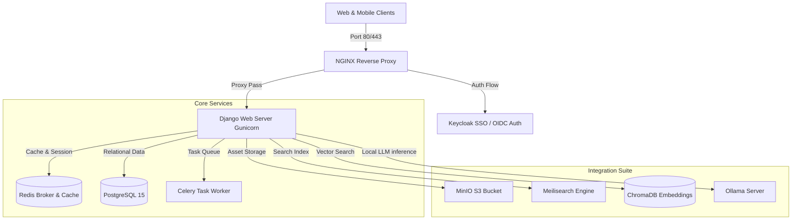
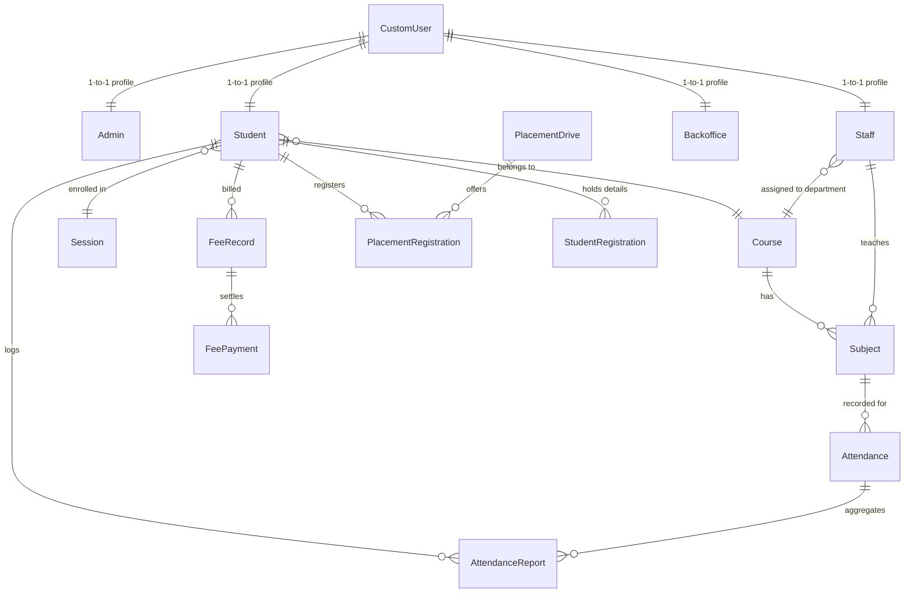
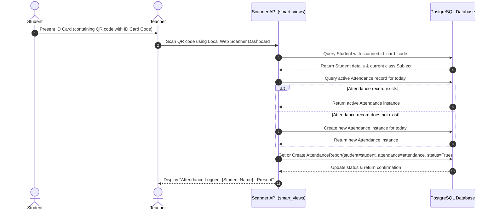
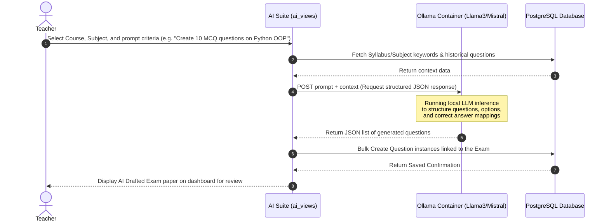

# College ERP System - Comprehensive Technical Documentation & Synopsis

This document provides a detailed overview of the system architecture, database models, frontend layout, backend business logic, routing flow, and feature status audit for the **College ERP System**.

---

## 1. Project Synopsis & Overview

The **College ERP System** is a production-ready, multi-tenant SaaS-enabled Enterprise Resource Planning platform designed for educational institutions. It facilitates administrative actions, academic tracking, student behavior grading, online examinations, virtual classrooms, fee collections, library cataloging, and campus placement drives.

### Core Roles & Target Users
1. **HOD / Administrator (Role `1`)**: Manages administrative units, staff and student enrollment, session terms, courses, departments, fee structures, notifications, leave approvals, and analytics.
2. **Staff / Teacher (Role `2`)**: Takes and updates student class attendance, registers test/exam grades, manages library issues, schedules and hosts virtual classrooms, and creates assignments or question papers.
3. **Student (Role `3`)**: Views timetables and attendance statistics, submits class assignments, borrows library books, views exam results, pays fees, creates resumes using an AI builder, and joins live virtual lectures.
4. **Parent (Role `4`)**: Tracks their child’s academic performance, fees structure, attendance history, and schedules.
5. **Alumni (Role `5`)**: Connects with current placement systems, views recruitment opportunities, and tracks career resources.
6. **Company HR (Role `6`)**: Posts job roles, filters candidate databases, schedules interviews, and offers selections.
7. **Back Office (Role `7`)**: Processes student admissions, fee structures, certificate requests, and generates accounting statements.

---

## 2. System Architecture & Topology

The system uses a dockerized service topology designed for high availability, search indexing, single sign-on (SSO), and local AI-assisted suite operations.

### High-Level Architecture Diagram


### Component Details
*   **NGINX**: Acts as the entry-point reverse proxy, managing security headers, mapping public/private media, and caching static assets.
*   **Keycloak**: Provides OpenID Connect (OIDC) Single Sign-On (SSO) authentication for unified credential management across portals.
*   **PostgreSQL 15**: Multi-tenant database system utilizing the `django-tenants` library to establish schema-level tenant isolation.
*   **Redis**: Serves as the memory cache store, Django session repository, and Celery asynchronous task broker.
*   **Ollama**: Hosts local open-weight Large Language Models (e.g., Llama 3, Mistral) to automate exam-paper and timetable drafting.
*   **ChromaDB**: Manages vectorized learning materials and student context vectors for context-aware AI search.
*   **MinIO**: Secure S3-compatible file storage for student files, document uploads, and dynamic certificate assets.

---

## 3. Backend Architecture & Multi-Tenancy Logic

### Shared-Model Schema Isolation
The platform separates data globally across colleges using **schema-level multi-tenancy** driven by `django-tenants`. 

```
PostgreSQL Database
  ├── Public Schema (public)
  │     ├── saas_admin_client (Tenant definitions: schema_name, paid_until)
  │     └── saas_admin_domain (Domain-to-tenant mappings: domain_name -> client_id)
  │
  ├── Tenant Schema A (college1_db)
  │     ├── main_app_student
  │     ├── main_app_staff
  │     └── main_app_attendance
  │
  └── Tenant Schema B (college2_db)
        ├── main_app_student
        ├── main_app_staff
        └── main_app_attendance
```

When a user triggers a request, the `TenantMainMiddleware` intercepts the incoming hostname (e.g., `college1.example.com`), matches it against domains stored in the `public` schema, and dynamically switches the database connection search path to point exclusively to the corresponding tenant schema (e.g., `college1_db`).

### Middleware Pipeline
```
[Client Request]
       │
       ▼
1. TenantMainMiddleware (Determines active DB schema based on hostname)
       │
       ▼
2. SecurityMiddleware (Configures SSL redirects & security headers)
       │
       ▼
3. SessionMiddleware (Retrieves session state from Redis)
       │
       ▼
4. LocaleMiddleware (Detects language for localization translation)
       │
       ▼
5. CsrfViewMiddleware (Performs cross-site request forgery token checks)
       │
       ▼
6. AuthenticationMiddleware (Verifies user auth credentials or OIDC JWT tokens)
       │
       ▼
7. MessageMiddleware (Handles temporary alert flash messages)
       │
       ▼
8. WhiteNoiseMiddleware (Fast static file compiler service)
       │
       ▼
[Active Django View Handler]
```

---

## 4. Database Schema Reference (Data Models)

The following diagram illustrates core operational model relationships inside each isolated tenant schema:



### Core Models & Business Logic

1.  **CustomUser**: Core auth model extending `AbstractUser`. Uses the `email` field instead of usernames.
    *   `user_type`: Enum (`1=HOD`, `2=Staff`, `3=Student`, `4=Parent`, `5=Alumni`, `6=CompanyHR`, `7=Backoffice`).
    *   `fcm_token`: Firebase Cloud Messaging token for mobile push alerts.
2.  **Student**: Holds student profiles.
    *   `unique_student_code`: Automatically generated string on save (e.g., `CS-2026-JD-ABCD`).
    *   `id_card_code`: Unique UUID-based token represented as a barcode and QR code.
3.  **Staff**: Holds teacher profiles, including salary details, mobile numbers, and temporary job letter passcodes.
4.  **Course & Subject**: Program outlines and individual classroom modules. Courses specify `monthly_fees` and `total_semesters` to enforce validation rules.
5.  **Attendance & AttendanceReport**: Manages daily records. QR/RFID check-ins update `AttendanceReport.status` to `True` for present and `False` for absent.
6.  **FeeRecord & FeePayment**: Billed invoices and payment gateway transactions (linked to Razorpay).
7.  **PlacementDrive & PlacementRegistration**: Manages recruitment drives and applicant statuses.
8.  **StudentRegistration**: Multi-step registration records detailing personal info, parents, addresses, castes, and uploaded verification documents.
9.  **LiveClass & LiveClassAttendance**: Captures virtual classroom Jitsi sessions, scheduling metadata, and student participation durations.
10. **IssuedBook**: Library logs mapping student email accounts to positive integer ISBN library book collections.

---

## 5. Frontend Layout & Asset Engine

The frontend is constructed using structured Django HTML templates, styled with Custom Vanilla CSS, and enhanced using major client-side interactive libraries.

### Template Hierarchy
```
frontend/templates/
├── main_app/                # General layouts (base.html, login.html, erpnext_sidebar.html)
├── hod_template/            # Admin dashboards, system setups, batch controls
├── staff_template/          # Attendance desks, exam results entries, LMS controls
├── student_template/        # Course viewers, AI helpers, virtual classrooms, bookshelves
├── parent_template/         # Academic metrics monitors, financial schedules
├── backoffice_template/     # Student verification boards, leave audits, fee collections
└── registration/            # Multistep online application portals
```

### Interactive Frontend Integrations
*   **JsBarcode**: Dynamic JavaScript engine used to generate PVC-style printable barcodes (CODE128 format) from `id_card_code` values on digital ID cards.
*   **HTML5-QRcode & Instascan**: Local camera-feed reader allowing staff/security terminals to verify visitor passes or log attendance.
*   **Chart.js**: Client-side canvas graphics library displaying analytics dashboards, class progress, and departmental performance trends.
*   **AdminLTE**: Provides standard visual structures, menus, widgets, grids, and sidebar interfaces.

---

## 6. Logic Connections & Data Flows

### A. Student QR Attendance Flow
This sequence shows how a student logs attendance by scanning their digital ID card QR code at the teacher's scanner terminal:



### B. AI Exam Paper Generation Flow
This flow represents how teachers generate exam questions using local AI inference:



---

## 7. Routing & Page Status Audit

An audit run of the application backend views against frontend templates indicates the following page statuses:

### Live & Verified Pages
The core modules have been fully verified with SQLite test suites running under Python 3.14.3. The following pages are fully operational:

| Path | View Handler | Template Rendered | Role Access | Status |
| :--- | :--- | :--- | :--- | :--- |
| `/` | `views.login_page` | `main_app/login.html` | Anonymous / All | **LIVE** |
| `/admin/home/` | `hod_views.admin_home` | `hod_template/home_content.html` | HOD / Admin | **LIVE** |
| `/admin/batches/` | `hod_views.admin_manage_batches` | `hod_template/manage_batches.html` | HOD / Admin | **LIVE** |
| `/staff/home/` | `staff_views.staff_home` | `staff_template/erpnext_staff_home.html` | Staff / Teacher | **LIVE** |
| `/staff/attendance/take/` | `staff_views.staff_take_attendance` | `staff_template/staff_take_attendance.html` | Staff / Teacher | **LIVE** |
| `/student/home/` | `student_views.student_home` | `student_template/erpnext_student_home.html` | Student | **LIVE** |
| `/student/timetable/` | `student_views.student_timetable` | `student_template/student_timetable.html` | Student | **LIVE** |
| `/student/payable-fees/` | `student_views.student_payable_fees` | `student_template/student_payable_fees.html` | Student | **LIVE** |
| `/student/viewbooks/` | `student_views.view_books` | `student_template/view_books.html` | Student | **LIVE** |
| `/student/report-card/` | `student_views.student_report_card` | `student_template/student_report_card.html` | Student | **LIVE** |
| `/chat/` | `chat_views.chat_home` | `main_app/chat.html` | All authenticated | **LIVE** |

---

### Pending & Template-Missing Pages
The template audit reveals several view endpoints that are registered in `urls.py` but currently lack active html files or contain unresolved mock definitions. These represent pending features:

| Unresolved Endpoint | Registered View | Target Template | Issue | Status |
| :--- | :--- | :--- | :--- | :--- |
| `/parent/home/` | `parent_views.parent_home` | `parent_template/parent_home.html` | Parent portal layouts and core templates are missing. | **PENDING** |
| `/parent/attendance/` | `parent_views.parent_attendance_detail` | `parent_template/attendance_detail.html` | Missing HTML view template. | **PENDING** |
| `/parent/fees/` | `parent_views.parent_fee_view` | `parent_template/fee_view.html` | Missing HTML view template. | **PENDING** |
| `/parent/results/` | `parent_views.parent_results_view` | `parent_template/results_view.html` | Missing HTML view template. | **PENDING** |
| `/parent/timetable/` | `parent_views.parent_timetable` | `parent_template/timetable.html` | Missing HTML view template. | **PENDING** |
| `/parent/feedback/` | `parent_views.parent_feedback` | `parent_template/feedback.html` | Missing HTML view template. | **PENDING** |
| `/parent/profile/` | `parent_views.parent_profile` | `parent_template/profile.html` | Missing HTML view template. | **PENDING** |
| `/backoffice/admissions/` | `backoffice_views.backoffice_admissions` | `backoffice_template/admissions.html` | Backoffice portal views are declared in `urls.py` but templates do not exist. | **PENDING** |
| `/backoffice/fees/` | `backoffice_views.backoffice_fees` | `backoffice_template/fees.html` | Missing HTML view template. | **PENDING** |
| `/backoffice/certificates/` | `backoffice_views.backoffice_certificates` | `backoffice_template/certificates.html` | Missing HTML view template. | **PENDING** |
| `/backoffice/leaves/` | `backoffice_views.backoffice_leaves` | `backoffice_template/leaves.html` | Missing HTML view template. | **PENDING** |
| `/backoffice/reports/` | `backoffice_views.backoffice_reports` | `backoffice_template/reports.html` | Missing HTML view template. | **PENDING** |
| `/backoffice/profile/` | `backoffice_views.backoffice_profile` | `backoffice_template/profile.html` | Missing HTML view template. | **PENDING** |

---

## 8. Summary of Development Workflow & Custom Plugins

This repository is maintained using an automated agent workflows system (ECC version 2.0.0).

### Installed Plugins
*   **Ponytail Plugin**: Rulesets and capabilities installed to manage project technical debt, code audits, and cleanups automatically.
    *   Ruleset configuration: [.agent/rules/ponytail.md](file:///c:/Users/Amaan/OneDrive/Desktop/College-ERP-main/.agent/rules/ponytail.md)
    *   Skills configurations: [.agent/skills/ponytail/](file:///c:/Users/Amaan/OneDrive/Desktop/College-ERP-main/.agent/skills/)

### Local Testing Guidelines
To run the automated Django test suites in a local development environment:
```powershell
# Set python path and execute pytest
$env:PYTHONPATH="backend"
venv\Scripts\python -m pytest backend/ --ds=college_management_system.test_settings
```
This runs test fixtures with SQLite in-memory databases, bypassing Keycloak and multi-tenancy requirements for rapid validation.
