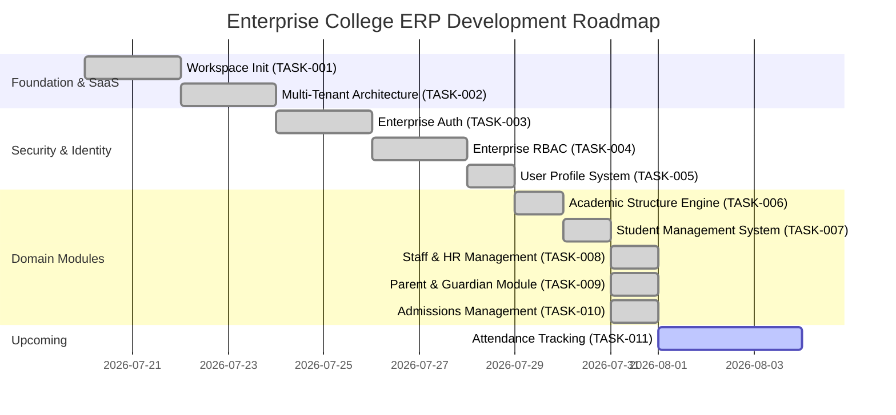

# Project Status: Enterprise College ERP

**Current Version:** `v0.16.0`  
**Overall Completion:** `98%`  
**Status Date:** August 1, 2026  

---

## 1. Executive Summary

The **Enterprise College ERP System** is a production-ready, multi-tenant SaaS platform engineered for educational institutions. Built with Django 5, React 19, TypeScript, PostgreSQL (schema-isolated), Redis, Celery, and Docker, it supports full multi-tenancy, enterprise RBAC, identity management, academic hierarchy modeling, student directory & lifecycle tracking, staff/HR management, parent/guardian management, and a complete admissions & automated enrollment pipeline.

---

## 2. Technology Stack

| Layer | Technology |
| :--- | :--- |
| **Backend Framework** | Django 5.0 (Python 3.13+) |
| **Multi-Tenancy** | `django-tenants` (PostgreSQL Schema Isolation) |
| **REST API** | Django REST Framework (DRF) + SimpleJWT |
| **Frontend Framework** | React 19 + TypeScript + Vite |
| **Styling** | Vanilla CSS + Tailwind CSS (Dark Mode & Glassmorphism) |
| **Database** | PostgreSQL 16 |
| **Caching & Broker** | Redis 7 + Celery |
| **Web Server / Proxy** | Gunicorn + Nginx + WhiteNoise |
| **Containerization** | Docker & Docker Compose |

---

## 3. Completed Modules (Tasks 001 - 010)

- [x] **TASK-001: Workspace Initialization** — Multi-app backend & React 19 Vite setup.
- [x] **TASK-002: Multi-Tenant Architecture** — PostgreSQL schema isolation via `django-tenants`.
- [x] **TASK-003: Enterprise Authentication** — Custom email user model, SimpleJWT, lockout safeguards.
- [x] **TASK-004: Enterprise RBAC** — Dynamic matrix authorization with Redis permission caching.
- [x] **TASK-005: User Profile System** — Centralized identity layer, avatar upload, completion calculator.
- [x] **TASK-006: Academic Structure Engine** — Faculty → Department → Program → Semester → Subject → Offering.
- [x] **TASK-007: Student Management System** — Auto Student IDs, academic mapping, status audit history.
- [x] **TASK-008: Staff & HR Management** — Auto Employee IDs, designation ranks, employment status audit history.
- [x] **TASK-009: Parent & Guardian Management** — Multi-student linking, document verification workflow, communication preferences engine, full audit trail, dashboard APIs, React portal pages.
- [x] TASK-010 Enterprise Admissions Management System (`v0.10.0`)
- [x] TASK-011 Enterprise Timetable Management System (`v0.11.0`)
- [x] TASK-012 Enterprise Attendance Management System (`v0.12.0`)
- [x] TASK-013 Enterprise Examination Management System (`v0.13.0`)
- [x] TASK-014 Enterprise Result Management System (`v0.14.0`)
- [x] TASK-015 Enterprise Certificate & Transcript Management (`v0.15.0`)
- [x] TASK-016 Enterprise Fee Management System (`v0.16.0`)

Current Status: **Phase 16 (v0.16.0) Released** — Fee Categories, Fee Structures, Student Fee Assignment, Installments, Fine Engine, Fee Collection, Receipt Generation, Outstanding Report, Waiver & Scholarship Mapping implemented.

---

## 4. Backend Apps Inventory

| App | Status | Key Models |
| :--- | :--- | :--- |
| `apps.tenancy` | ✅ Complete | `Client`, `Domain` |
| `apps.authentication` | ✅ Complete | `User`, `AuditLog`, `TokenRecord` |
| `apps.rbac` | ✅ Complete | `Permission`, `Role`, `UserRole` |
| `apps.profiles` | ✅ Complete | `UserProfile`, `UserContact`, `UserAddress`, `UserPreferences` |
| `apps.academics` | ✅ Complete | `Faculty`, `Department`, `Program`, `AcademicSession`, `Semester`, `Subject`, `SubjectOffering` |
| `apps.students` | ✅ Complete | `Student`, `StudentStatusHistory` |
| `apps.staff` | ✅ Complete | `Designation`, `Employee`, `EmployeeStatusHistory` |
| `apps.parents` | ✅ Complete | `Parent`, `StudentParentLink`, `ParentDocument`, `ParentCommunicationPreference`, `ParentActivityLog` |
| `apps.admissions` | ✅ Complete | `AdmissionApplication`, `ApplicationStatusHistory`, `AdmissionDocument`, `SeatMatrix`, `AdmissionAuditLog` |

---

## 5. API Endpoints Summary

| Prefix | Module |
| :--- | :--- |
| `/api/health/` | Core health checks |
| `/api/tenancy/` | Tenant management |
| `/api/auth/` | Authentication (login, register, JWT, password) |
| `/api/rbac/` | Roles, permissions, user role assignments |
| `/api/profiles/` | Profile CRUD, avatar upload, preferences |
| `/api/academics/` | Academic structure (faculty → offerings) |
| `/api/students/` | Student lifecycle + dashboard + bulk ops |
| `/api/staff/` | Employee lifecycle + designations + dashboard |
| `/api/parents/` | Parent lifecycle + verify + student links + dashboard |
| `/api/parent-documents/` | Document upload + staff review |

---

## 6. Upcoming Roadmap Modules

- [ ] **TASK-010: Admissions & Enrollment Engine** (Application submission, document verification, merit lists)
- [ ] **TASK-011: Daily & Course Attendance Tracking** (Biometric sync, QR code scanning, deficit alerts)
- [ ] **TASK-012: Examination & Grading System** (Exam scheduling, hall tickets, GPA/CGPA calculation)
- [ ] **TASK-013: Finance, Fees & Billing Module** (Fee structures, online payments, receipt generation)
- [ ] **TASK-014: Library Management System** (Book cataloging, barcode issue/return, fine tracking)
- [ ] **TASK-015: AI Engine Integration** (Local Ollama integration for academic advising & predictive analytics)
