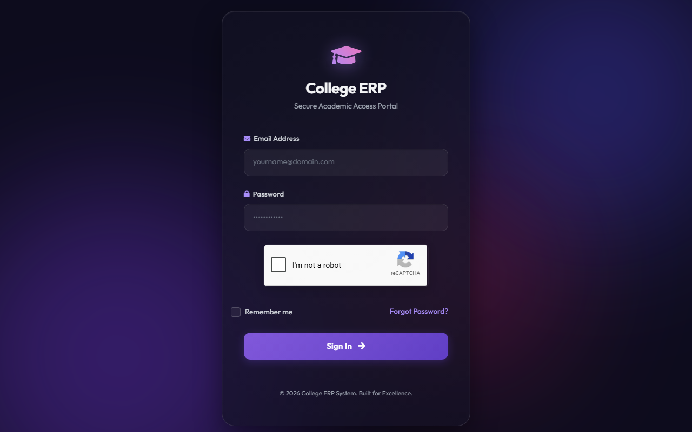
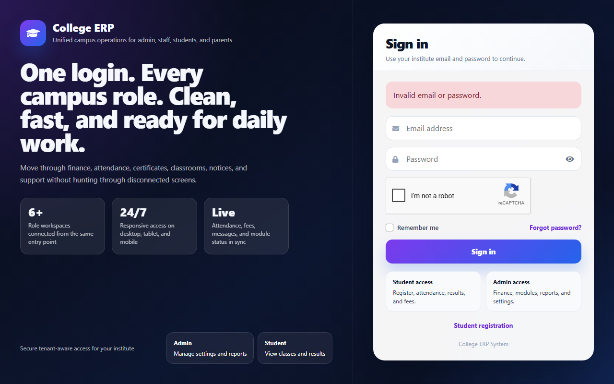
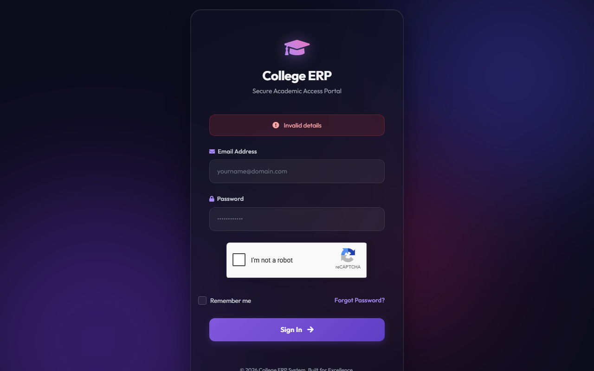
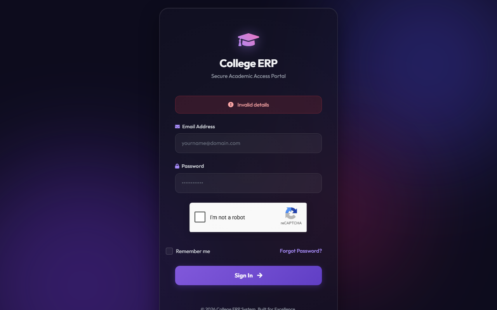
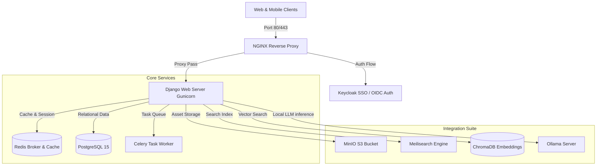
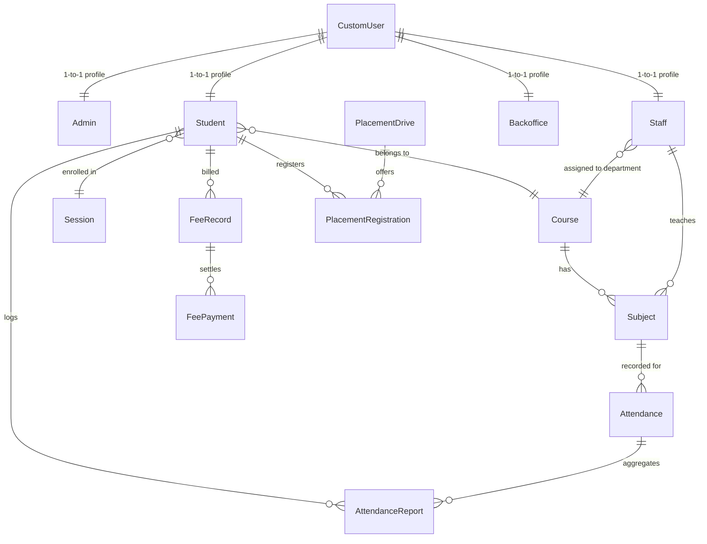
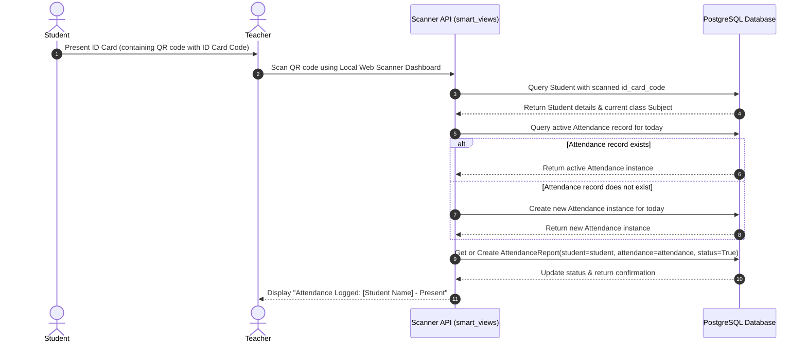
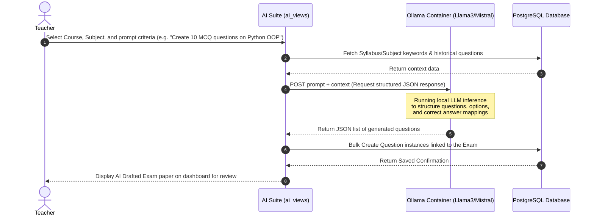

<div align="center">

# 🎓 College ERP System 🚀
**A Next-Generation Multi-Tenant SaaS Enterprise Resource Planning Solution for Educational Institutions**

[](https://www.python.org/)
[](https://www.djangoproject.com/)
[](LICENSE)
[](https://github.com/amaanmulani9-ai)

*Streamline administration, empower staff, and engage students with a single unified platform.*

[Report a Bug](https://github.com/amaanmulani9-ai/College-ERP/issues) • [Request Feature](https://github.com/amaanmulani9-ai/College-ERP/issues)

</div>

---

## 🌟 Overview

**College ERP** is a full-stack educational management system designed for multi-college SaaS deployments. It bridges the gap between Administration, Staff, Students, and Parents by providing real-time data synchronization, dynamic dashboards, and automated workflows.

Built on Django and PostgreSQL, the platform utilizes schema-level database isolation to securely partition institutional records while offering premium web interfaces, offline PWA access, mobile API sync, and an integrated AI Suite for academic automation.

---

## 📸 Screenshots

Here are some glimpses of the **College ERP** in action:

| Login Portal | Admin Dashboard |
|:---:|:---:|
|  |  |

| Staff Portal | Student Portal |
|:---:|:---:|
|  |  |

---

## 🗺️ High-Level System Architecture

The platform uses a Docker-based topology configured for search indexing, single sign-on (SSO), vector indexing, and local LLM execution.



### Component Details
*   **NGINX**: Reverse proxy handling security headers, caching static assets, and routing requests.
*   **Keycloak**: OpenID Connect (OIDC) Single Sign-On provider mapping user groups to ERP roles.
*   **PostgreSQL 15**: Primary database utilizing schema partitions via `django-tenants` for SaaS isolation.
*   **Redis**: In-memory storage acting as Celery's task queue broker and the Django cache repository.
*   **Ollama**: Hosts local open-weight LLMs (e.g. Llama 3, Mistral) for drafting timetables and exam papers.
*   **ChromaDB**: Native vector database used for local embedding retrieval to support AI operations.
*   **MinIO**: Secure S3-compatible file storage for student files, document uploads, and dynamic certificate assets.

---

## ⚙️ Backend Multi-Tenancy & Data Model

### Shared-Model Schema Isolation
Institutional data is isolated at the database schema level using `django-tenants`:

```
PostgreSQL Database
  ├── Public Schema (public)
  │     ├── saas_admin_client (Tenant definitions: schema_name, paid_until)
  │     └── saas_admin_domain (Domain-to-tenant mappings: domain_name -> client_id)
  │
  ├── Tenant Schema A (college1_db)
  │     ├── main_app_student
  │     ├── main_app_staff
  │     └── main_app_attendance
  │
  └── Tenant Schema B (college2_db)
        ├── main_app_student
        ├── main_app_staff
        └── main_app_attendance
```

When a request arrives, `TenantMainMiddleware` extracts the active hostname, queries domain mappings in the `public` schema, and switches the active PostgreSQL search path to the matching client schema dynamically.

### Core Data Models
Inside each tenant schema, relations are structured as follows:



*   **CustomUser** ([models.py](file:///c:/Users/Amaan/OneDrive/Desktop/College-ERP-main/College-ERP-main/backend/main_app/models.py#L48-L68)): Core user authentication model extending `AbstractUser`. Uses the email address for logins. Matches role permissions using `user_type`.
*   **Student** ([models.py](file:///c:/Users/Amaan/OneDrive/Desktop/College-ERP-main/College-ERP-main/backend/main_app/models.py#L108-L215)): Profiles containing unique enrollment codes, batch years, semesters, and digital ID card codes.
*   **Staff** ([models.py](file:///c:/Users/Amaan/OneDrive/Desktop/College-ERP-main/College-ERP-main/backend/main_app/models.py#L233-L248)): Employee records, linking to departments and salary slips.
*   **Subject & Course** ([models.py](file:///c:/Users/Amaan/OneDrive/Desktop/College-ERP-main/College-ERP-main/backend/main_app/models.py#L85-L97)): Holds program configurations, monthly fees, semesters constraints, and teaching assignments.
*   **FeeRecord & FeePayment** ([models.py](file:///c:/Users/Amaan/OneDrive/Desktop/College-ERP-main/College-ERP-main/backend/main_app/models.py#L447-L480)): Billed items, invoices, balances, and payment gateway logs.
*   **LiveClass** ([models.py](file:///c:/Users/Amaan/OneDrive/Desktop/College-ERP-main/College-ERP-main/backend/main_app/models.py#L845-L870)): Virtual class scheduling linked with Jitsi Meet rooms.

---

## 🎨 Frontend Design & Layout Tree

The user interface uses Django templates populated dynamically, styled with Bootstrap, Custom Vanilla CSS, and client-side interactive libraries.

### Template Hierarchy
```
frontend/templates/
├── main_app/                # General layouts (base.html, login.html, erpnext_sidebar.html)
├── hod_template/            # Admin dashboards, system setups, batch controls
├── staff_template/          # Attendance desks, exam results entries, LMS controls
├── student_template/        # Course viewers, AI helpers, virtual classrooms, bookshelves
├── parent_template/         # Academic metrics monitors, financial schedules
├── backoffice_template/     # Student verification boards, leave audits, fee collections
└── registration/            # Multistep online application portals
```

### Key Frontend Integrations
*   **JsBarcode**: Generates dynamic CODE128 barcodes from student/staff identifiers on flippable ID cards.
*   **HTML5-QRcode**: Webcam-based scanner integration for verifying QR attendance or library transactions.
*   **Chart.js**: Visual stats engine displaying analytics dashboards, class progress, and student attendance metrics.
*   **AdminLTE**: UI layout skeleton, sidebar components, and custom admin forms styling.

---

## 🔄 Detailed Logic Connection Flowcharts

### A. Student QR Attendance Flow
How a student scans their digital ID card QR code at the teacher's scanner terminal to mark attendance:



### B. AI Exam Paper Generation Flow
How teachers generate exam questions using local AI inference:



---

## 🚦 Registered Routes & Page Status Audit

An automated backend audit shows the following template-to-view statuses:

### Live & Verified Pages
The core modules are fully covered by SQLite test suites running under Python 3.14.3.

| Path | View Handler | Template Rendered | Role Access | Status |
| :--- | :--- | :--- | :--- | :--- |
| `/` | `views.login_page` | `main_app/login.html` | Anonymous / All | **LIVE** |
| `/admin/home/` | `hod_views.admin_home` | `hod_template/home_content.html` | HOD / Admin | **LIVE** |
| `/admin/batches/` | `hod_views.admin_manage_batches` | `hod_template/manage_batches.html` | HOD / Admin | **LIVE** |
| `/staff/home/` | `staff_views.staff_home` | `staff_template/erpnext_staff_home.html` | Staff / Teacher | **LIVE** |
| `/staff/attendance/take/` | `staff_views.staff_take_attendance` | `staff_template/staff_take_attendance.html` | Staff / Teacher | **LIVE** |
| `/student/home/` | `student_views.student_home` | `student_template/erpnext_student_home.html` | Student | **LIVE** |
| `/student/timetable/` | `student_views.student_timetable` | `student_template/student_timetable.html` | Student | **LIVE** |
| `/student/payable-fees/` | `student_views.student_payable_fees` | `student_template/student_payable_fees.html` | Student | **LIVE** |
| `/student/viewbooks/` | `student_views.view_books` | `student_template/view_books.html` | Student | **LIVE** |
| `/student/report-card/` | `student_views.student_report_card` | `student_template/student_report_card.html` | Student | **LIVE** |
| `/chat/` | `chat_views.chat_home` | `main_app/chat.html` | All authenticated | **LIVE** |

### Pending & Template-Missing Pages
The template audit reveals several view endpoints that are registered in `urls.py` but currently lack active html files or contain unresolved mock definitions:

| Unresolved Endpoint | Registered View | Target Template | Issue | Status |
| :--- | :--- | :--- | :--- | :--- |
| `/parent/home/` | `parent_views.parent_home` | `parent_template/parent_home.html` | Parent portal layouts and core templates are missing. | **PENDING** |
| `/parent/attendance/` | `parent_views.parent_attendance_detail` | `parent_template/attendance_detail.html` | Missing HTML view template. | **PENDING** |
| `/parent/fees/` | `parent_views.parent_fee_view` | `parent_template/fee_view.html` | Missing HTML view template. | **PENDING** |
| `/parent/results/` | `parent_views.parent_results_view` | `parent_template/results_view.html` | Missing HTML view template. | **PENDING** |
| `/parent/timetable/` | `parent_views.parent_timetable` | `parent_template/timetable.html` | Missing HTML view template. | **PENDING** |
| `/parent/feedback/` | `parent_views.parent_feedback` | `parent_template/feedback.html` | Missing HTML view template. | **PENDING** |
| `/parent/profile/` | `parent_views.parent_profile` | `parent_template/profile.html` | Missing HTML view template. | **PENDING** |
| `/backoffice/admissions/` | `backoffice_views.backoffice_admissions` | `backoffice_template/admissions.html` | Backoffice portal views are declared in `urls.py` but templates do not exist. | **PENDING** |
| `/backoffice/fees/` | `backoffice_views.backoffice_fees` | `backoffice_template/fees.html` | Missing HTML view template. | **PENDING** |
| `/backoffice/certificates/` | `backoffice_views.backoffice_certificates` | `backoffice_template/certificates.html` | Missing HTML view template. | **PENDING** |
| `/backoffice/leaves/` | `backoffice_views.backoffice_leaves` | `backoffice_template/leaves.html` | Missing HTML view template. | **PENDING** |
| `/backoffice/reports/` | `backoffice_views.backoffice_reports` | `backoffice_template/reports.html` | Missing HTML view template. | **PENDING** |
| `/backoffice/profile/` | `backoffice_views.backoffice_profile` | `backoffice_template/profile.html` | Missing HTML view template. | **PENDING** |

---

## 🚀 Getting Started

Follow these steps to get a local copy up and running on your machine.

### Prerequisites
Make sure you have [Python 3.8+](https://www.python.org/downloads/) installed on your system.

### Installation

1. **Clone the repository**
   ```bash
   git clone https://github.com/amaanmulani9-ai/College-ERP.git
   cd College-ERP
   ```

2. **Create a virtual environment (Recommended)**
   ```bash
   python -m venv venv
   # Activate on Windows:
   venv\Scripts\activate
   # Activate on macOS/Linux:
   source venv/bin/activate
   ```

3. **Install dependencies**
   ```bash
   pip install -r backend/requirements.txt
   ```

4. **Apply database migrations**
   ```bash
   python manage.py makemigrations
   python manage.py migrate
   ```

5. **Create a Superuser (Admin Account)**
   ```bash
   python manage.py createsuperuser
   ```

6. **Run the development server**
   ```bash
   python manage.py runserver
   ```

7. **Access the application**
   Open your browser and navigate to `http://localhost:8000`.

### Running Tests
To execute the automated Django test suites in a local development environment:
```powershell
# Set python path and execute pytest
$env:PYTHONPATH="backend"
venv\Scripts\python -m pytest backend/ --ds=college_management_system.test_settings
```

---

## ☁️ Deploy on Vercel (with Supabase Postgres)

### 1. Connect Supabase to Vercel

1. Create a project at [supabase.com](https://supabase.com)
2. In **Project Settings → Database**, copy the connection strings
3. In Vercel → **Project Settings → Environment Variables**, add:

| Variable | Value |
|----------|-------|
| `POSTGRES_PRISMA_URL` | **Transaction pooler** (port `6543`) — app runtime |
| `POSTGRES_HOST` | `db.your-project-ref.supabase.co` |
| `POSTGRES_USER` | `postgres` |
| `POSTGRES_PASSWORD` | Your database password |
| `POSTGRES_DATABASE` | `postgres` |
| `SUPABASE_URL` | `https://your-project-ref.supabase.co` |
| `NEXT_PUBLIC_SUPABASE_ANON_KEY` | From Supabase API settings |
| `SUPABASE_SERVICE_ROLE_KEY` | From Supabase API settings (server only) |
| `SECRET_KEY` | A long random Django secret |
| `DEBUG` | `False` |

**Important:** For migrations, use the **direct** host (`db.xxx.supabase.co:5432`), not the pooler on port 5432. The build command handles this automatically via `POSTGRES_HOST`.

### 2. Deploy

```bash
git push
```

Vercel will run migrations (direct connection) → `collectstatic` → deploy.

### 3. Create admin account

```bash
vercel env pull .env.local
python manage.py createsuperuser
```

---

## 🔐 Default Demo Accounts

If you have seeded the database with test data, you can use the following default accounts to explore the system:

| Role | Email Address | Password |
|------|---------------|----------|
| **Staff** | `staffone@staff.com` | `staffone` |
| **Student** | `studentone@student.com` | `studentone` |

---

## 🤝 Contributing

Contributions are what make the open-source community such an amazing place to learn, inspire, and create. Any contributions you make are **greatly appreciated**.

1. Fork the Project
2. Create your Feature Branch (`git checkout -b feature/AmazingFeature`)
3. Commit your Changes (`git commit -m 'Add some AmazingFeature'`)
4. Push to the Branch (`git push origin feature/AmazingFeature`)
5. Open a Pull Request

---

## 📜 License

Distributed under the MIT License. See `LICENSE` for more information.

---

<div align="center">
  <b>Built with ❤️ by <a href="https://github.com/amaanmulani9-ai">Amaan</a></b><br>
  <i>If you find this project helpful, please consider giving it a ⭐!</i>
</div>
