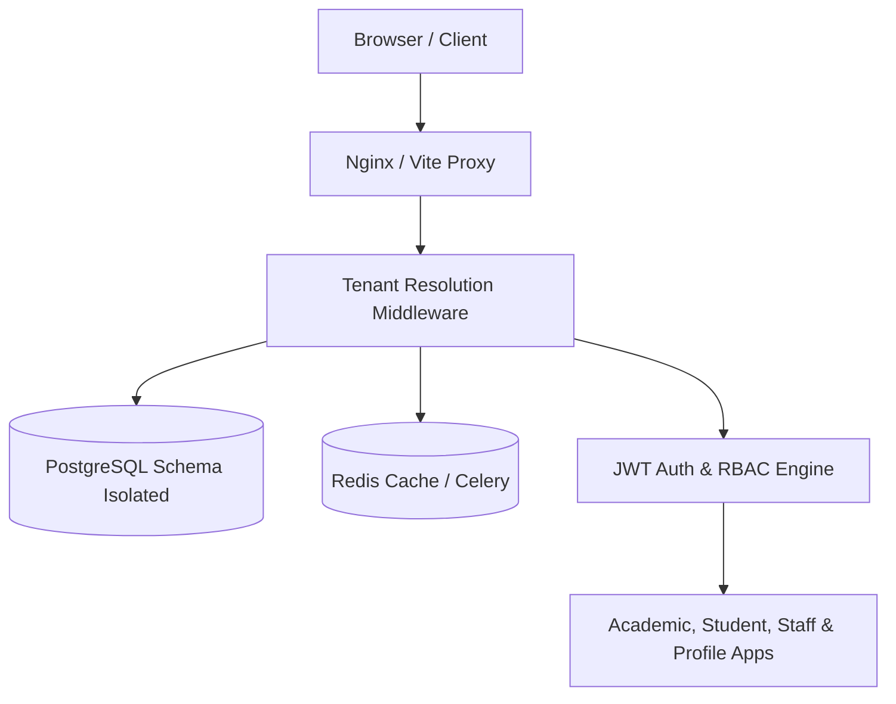

# Enterprise College ERP System

[](CHANGELOG.md)
[](LICENSE)
[](https://www.python.org/)
[](https://www.djangoproject.com/)
[](https://react.dev/)
[](https://www.typescriptlang.org/)

A production-ready, multi-tenant SaaS platform engineered to manage all academic, administrative, student, and personnel operations for educational institutions.

---

## 🚀 Key Features & Modules

- **Multi-Tenant SaaS Architecture**: PostgreSQL schema-based isolation powered by `django-tenants`. Each college gets an isolated schema while sharing application code.
- **Enterprise Authentication**: Email-based primary login, SimpleJWT access/refresh tokens with rotation & blacklisting, brute-force protection (15-min lockout after 5 failures).
- **Dynamic RBAC System**: 14 default institutional roles seeded automatically with Redis permission caching (`rbac:<schema>:user:<user_id>:permissions`).
- **Identity & User Profiles**: Centralized identity profile with avatar upload/deletion safeguards and completion percentage calculator.
- **Academic Structure Engine**: Tiered hierarchy modeling (`Faculty` -> `Department` -> `Program` -> `AcademicSession` -> `Semester` -> `Subject` -> `Offering`) with soft deletion safeguards.
- **Student Management System**: Auto Student ID generation (`ERP-YEAR-PROGRAM-SEQUENCE`), status lifecycle auditing (`applicant`, `active`, `suspended`, `graduated`, `withdrawn`, `alumni`), and guardian contact details.
- **Staff & HR Management System**: Auto Employee ID generation (`EMP-YEAR-SEQUENCE`), designation rank catalog (`teaching`, `non_teaching`, `administration`, etc.), and employment status auditing (`active`, `on_leave`, `suspended`, `resigned`, `retired`, `terminated`).

---

## 🏛️ System Architecture


```mermaid
graph TD
    User[Browser / Client] --> Proxy[Nginx / Vite Proxy]
    Proxy --> TenantMW[Tenant Resolution Middleware]
    TenantMW --> DB[(PostgreSQL Schema Isolated)]
    TenantMW --> Cache[(Redis Cache / Celery)]
    TenantMW --> Auth[JWT Auth & RBAC Engine]
    Auth --> Modules[Academic, Student, Staff & Profile Apps]
```

---

## 📁 Repository Structure

```
College-ERP/
├── backend/
│   ├── apps/
│   │   ├── academics/       # Academic Structure Engine
│   │   ├── authentication/  # Identity & JWT Authentication
│   │   ├── core/            # Core utilities & health check
│   │   ├── profiles/        # Centralized User Profiles
│   │   ├── rbac/            # Role-Based Access Control
│   │   ├── staff/           # Staff & HR Management System
│   │   ├── students/        # Student Management System
│   │   └── tenancy/         # SaaS Multi-Tenant Manager
│   ├── config/              # Modular settings & root URLs
│   └── manage.py
├── frontend/
│   ├── src/
│   │   ├── components/      # Reusable UI components & Sidebar
│   │   ├── layouts/         # Main Dashboard & Glassmorphism layouts
│   │   ├── pages/           # Module Management Pages
│   │   └── services/        # Axios API Client Layer
│   └── vite.config.ts
├── docs/                    # Architectural & Workflow Docs
├── scripts/                 # Verification & Setup Scripts
├── tests/                   # Automated Pytest Test Suite
├── CHANGELOG.md             # Version History
├── PROJECT_STATUS.md        # Roadmap & Completion Breakdown
├── RELEASE_NOTES_v0.8.0.md  # v0.8.0 Release Documentation
├── CONTRIBUTING.md          # Contribution Guidelines
├── SECURITY.md              # Security Policy & Reporting
└── LICENSE                  # MIT License
```

---

## 🛠️ Technology Stack

- **Backend**: Python 3.13+, Django 5.0, Django REST Framework, `django-tenants`, SimpleJWT
- **Frontend**: React 19, TypeScript, Vite, Vanilla CSS + Tailwind CSS, Axios, React Query
- **Database & Cache**: PostgreSQL 16, Redis 7
- **DevOps & Containers**: Docker, Docker Compose, Gunicorn, WhiteNoise

---

## ⚡ Quick Start & Development Setup

### 1. Environment Setup
Copy sample environment files:
```bash
cp .env.example .env
cp frontend/.env.example frontend/.env
```

### 2. Running with Docker Compose
```bash
docker-compose up -d --build
```
Access the application at `http://localhost:5173`.

### 3. Local Development (Without Docker)

**Backend Setup**:
```bash
cd backend
python -m venv ../venv
../venv/Scripts/activate   # On Windows (or source ../venv/bin/activate on Linux/Mac)
pip install -r requirements.txt
python manage.py migrate_schemas
python manage.py seed_rbac_defaults
python manage.py runserver 8000
```

**Frontend Setup**:
```bash
cd frontend
npm install
npm run dev
```

---

## 🧪 Automated Testing & Verification

Run unit & integration test suites:
```bash
# Run pytest across all backend apps
python -m pytest tests/

# Run module verification scripts
python scripts/verify_task6.py
python scripts/verify_task7.py
python scripts/verify_task8.py
```

---

## 📖 API Documentation

API endpoints are organized by app:
- **Authentication**: `/api/auth/`
- **Tenancy**: `/api/tenancy/`
- **RBAC Matrix**: `/api/rbac/`
- **User Profiles**: `/api/profiles/`
- **Academics**: `/api/academics/`
- **Students**: `/api/students/`
- **Staff & HR**: `/api/staff/`

For detailed schemas, refer to individual doc files in [`docs/`](docs/).

---

## 🗺️ Product Roadmap

- [x] **v0.8.0**: Foundation, Auth, RBAC, Academic Hierarchy, Student & Staff Modules.
- [ ] **v0.9.0**: Admissions Workflow & Application Processing Engine.
- [ ] **v0.10.0**: Daily & Subject Attendance Tracking Engine.
- [ ] **v0.11.0**: Examination, Grading & Transcript Management.
- [ ] **v1.0.0**: Production Release with Finance, Fee Collection, and AI Advising.

---

## 📄 License & Version

Distributed under the MIT License. See [`LICENSE`](LICENSE) for more information.

**Current Version:** `v0.8.0`
