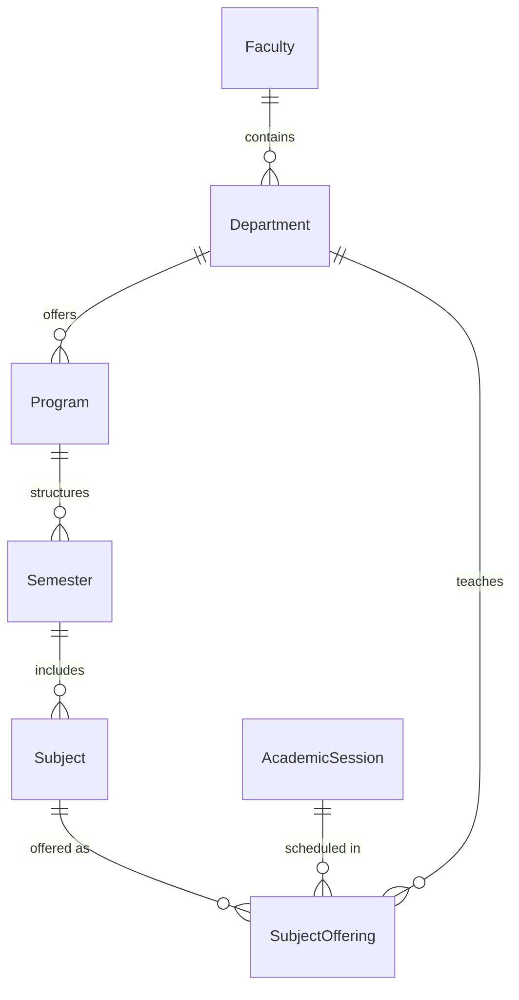

# Academic Structure Engine Documentation

## 1. System Architecture & Academic Hierarchy

The **Academic Structure Engine** (`apps/academics`) serves as the institutional foundation for the College ERP. All downstream modules (Admissions, Students, Staff, Timetable, Attendance, Examinations, Results, AI Engine) build directly upon these entities.

---

## 2. Core Entities (`apps/academics/models.py`)

### 1. `Faculty` (School / Division)
- `id`: UUID Primary Key
- `name`: Faculty Title (e.g., *Faculty of Engineering & Technology*)
- `code`: Abbreviation (e.g., `FET`)
- `dean`: Foreign Key to `User` (Optional Dean of Faculty)
- `display_order`, `is_active`, `is_deleted`

### 2. `Department`
- `id`: UUID Primary Key
- `faculty`: Foreign Key to parent `Faculty`
- `name`: Department Name (e.g., *Computer Science & Engineering*)
- `code`: Unique code per tenant (e.g., `CSE`)
- `hod`: Foreign Key to `User` (Optional Head of Department)
- `email`, `phone`

### 3. `Program` (Degree Level)
- `id`: UUID Primary Key
- `department`: Foreign Key to parent `Department`
- `name`: Program Title (e.g., *Bachelor of Computer Applications*)
- `code`: Unique code (e.g., `BCA`, `BSc IT`, `MBA`)
- `degree_level`: `UG`, `PG`, `Diploma`, `Doctorate`
- `duration_years`, `total_credits`

### 4. `AcademicSession`
- `id`: UUID Primary Key
- `name`: Session Year (e.g., `2025–2026`)
- `start_date`, `end_date`
- `is_current`: Boolean flag (**Enforces exactly one active current session per tenant**)

### 5. `Semester`
- `id`: UUID Primary Key
- `program`: Foreign Key to parent `Program`
- `semester_number`: Term number (1, 2, 3...)
- `credits`: Term credit target

### 6. `Subject` (Course)
- `id`: UUID Primary Key
- `code`: Subject Code (e.g., `CS101`)
- `name`: Subject Title (e.g., *Data Structures & Algorithms*)
- `semester`: Foreign Key to `Semester`
- `credits`, `theory_hours`, `practical_hours`
- `internal_marks`, `external_marks`, `passing_marks`
- `is_elective`: Boolean flag (Core vs Elective)

### 7. `SubjectOffering`
- `id`: UUID Primary Key
- `subject`: Foreign Key to `Subject`
- `session`: Foreign Key to `AcademicSession`
- `department`: Foreign Key to `Department`
- `capacity`: Maximum student intake capacity
- `status`: `offered`, `cancelled`, `completed`

---

## 3. Business Integrity Rules & Safeguards

1. **Soft Delete Protection**:
   - Entities implement `.soft_delete()`.
   - Attempting to delete a `Faculty` with active child `Department` records raises a `ValidationError`.
   - Attempting to delete a `Department` with active child `Program` records is blocked until children are resolved.
2. **Single Active Current Session**:
   - Setting `is_current = True` on any `AcademicSession` automatically unsets `is_current` on all other sessions for that tenant.
3. **Unique Semester Numbers**:
   - `unique_together = ("program", "semester_number")` prevents duplicate term numbers in a single program.

---

## 4. REST API Endpoints

| Endpoint Path | Method | Description |
| :--- | :--- | :--- |
| `/api/academics/faculties/` | `GET / POST` | List & create faculties |
| `/api/academics/departments/` | `GET / POST` | List & create departments |
| `/api/academics/programs/` | `GET / POST` | List & create academic programs |
| `/api/academics/sessions/` | `GET / POST` | List & create academic calendar years |
| `/api/academics/sessions/<id>/set-current/` | `POST` | Set session as the active current year |
| `/api/academics/semesters/` | `GET / POST` | List & create program semesters |
| `/api/academics/subjects/` | `GET / POST` | List & create curriculum subjects |
| `/api/academics/offerings/` | `GET / POST` | List & create active session subject offerings |
