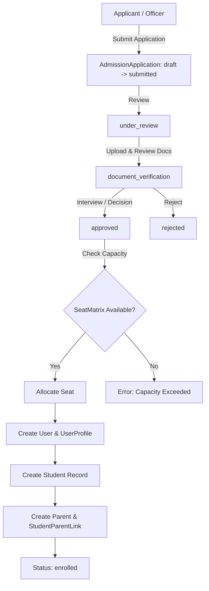
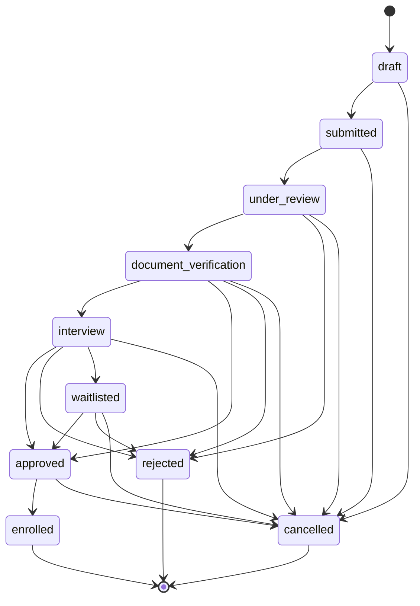

# Enterprise Admissions Management System Documentation

## 1. Architecture & Overview

The **Enterprise Admissions Management System** (`apps/admissions`) manages the entire prospective student lifecycle—from initial application submission through document verification, seat matrix quota checking, and automated student enrollment.

Upon approval and enrollment execution, it orchestrates existing platform services (`User`, `UserProfile`, `Student`, `Parent`, `StudentParentLink`) to create full institutional identities without duplicating data logic.

---

## 2. Application Workflow State Machine

The admission workflow enforces a strict 10-state state machine. Every state transition is recorded in `ApplicationStatusHistory` and `AdmissionAuditLog`.

---

## 3. Database Schema Design

### Core Entities

1. **`AdmissionApplication`**: Stores applicant PII, applying program, department, academic session, previous qualifications, guardian info, reviewer assignment, and current workflow status.
2. **`ApplicationStatusHistory`**: Tracks previous state, target state, actor, transition remarks, and timestamp.
3. **`AdmissionDocument`**: Uploaded supporting documents (`aadhaar`, `marksheet`, `birth_certificate`, `transfer_certificate`, `photo`, etc.) with approval/rejection review workflow.
4. **`SeatMatrix`**: Enforces capacity limits per `(program, academic_session, category)` tuple.
5. **`AdmissionAuditLog`**: Captures fine-grained audit events (`application_created`, `status_changed`, `document_approved`, `application_approved`, `student_created`, `parent_linked`, `enrollment_completed`).

---

## 4. Enrollment Pipeline Integration

When an approved application is enrolled via `enroll_application(application)`:
1. **Seat Allocation**: Decrements `SeatMatrix.available_seats` (using row-level `select_for_update` locking).
2. **Account Creation**: Generates `User` (email as login, default password) and `UserProfile`.
3. **Student Onboarding**: Invokes `generate_student_code(program)` to create `Student` bound to `Program`, `Department`, `Semester 1`, and `AcademicSession`.
4. **Parent Linkage**: If guardian details exist, creates `User` & `Parent` and invokes `link_student_to_parent(parent, student)` with primary contact flags.
5. **State Finalization**: Sets application state to `enrolled` and binds `enrolled_student`.

---

## 5. REST API Specifications

| Method | Endpoint | Description |
| :--- | :--- | :--- |
| `GET / POST` | `/api/admissions/applications/` | List applications (search, filter) / Create new |
| `GET / PATCH / DELETE` | `/api/admissions/applications/{id}/` | Retrieve, update, or soft-delete application |
| `POST` | `/api/admissions/applications/{id}/submit/` | Submit application (`draft → submitted`) |
| `POST` | `/api/admissions/applications/{id}/approve/` | Approve application |
| `POST` | `/api/admissions/applications/{id}/reject/` | Reject application |
| `POST` | `/api/admissions/applications/{id}/transition/` | Custom state machine transition |
| `POST` | `/api/admissions/applications/{id}/enroll/` | Execute automated Enrollment Pipeline |
| `POST` | `/api/admissions/applications/bulk-approve/` | Bulk approve applications |
| `POST` | `/api/admissions/applications/bulk-reject/` | Bulk reject applications |
| `POST` | `/api/admissions/applications/assign-reviewer/` | Bulk assign reviewer |
| `GET / POST` | `/api/admissions/documents/` | List / Upload application document |
| `POST` | `/api/admissions/documents/{id}/review/` | Staff approve/reject document |
| `GET / POST` | `/api/admissions/seat-matrix/` | Seat quota matrix CRUD |
| `GET` | `/api/admissions/dashboard/` | Admissions analytics KPI dashboard |
