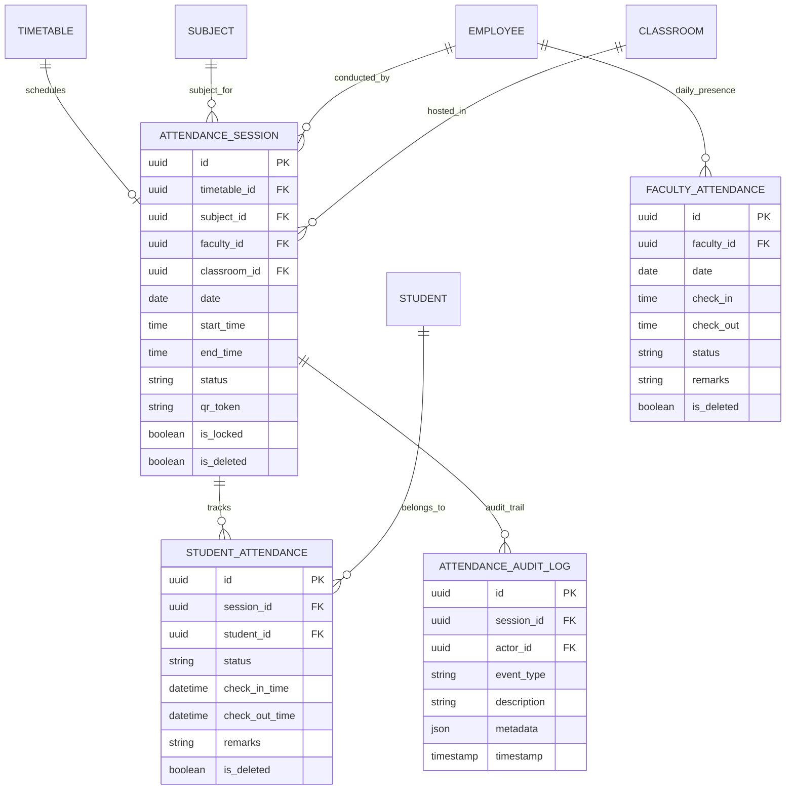

# Enterprise Attendance Management System Documentation

## Architecture & Overview

The **Enterprise Attendance Management System** (`apps/attendance/`) provides comprehensive tracking of student and faculty attendance, session locking, bulk marking, percentage analytics, QR token generation, biometric device integration readiness, and audit logging.

### Core Capabilities
- **Attendance Sessions**: Linked to Academic Subject, Faculty Employee, Classroom, Date, and Timetable.
- **Student Attendance Records**: Tracks status (`present`, `absent`, `late`, `half_day`, `excused`), check-in/out timestamps, and remarks.
- **Faculty Attendance Records**: Tracks instructor daily presence (`present`, `absent`, `late`, `half_day`, `on_leave`).
- **Session Locking Engine**: Enforces strict modification restrictions once a session is marked `is_locked=True`.
- **QR & Biometric Readiness**: Secure QR attendance token generator and biometric hardware payload validator interface.
- **Analytics & Reports**: Individual attendance percentages, daily institutional summaries, and monthly subject-wise reports.

---

## Entity Relationship (ER) Diagram

---

## Attendance Workflow

1. **Session Creation**: Faculty or Administrator creates an `AttendanceSession` referencing the `Timetable` slot and `Subject`. A secure SHA-256 `qr_token` is auto-generated.
2. **Attendance Marking**:
   - Single marking via `POST /api/attendance/sessions/{id}/mark/`
   - Bulk marking via `POST /api/attendance/sessions/bulk/`
3. **Session Locking**: Administrator or Faculty invokes `POST /api/attendance/sessions/{id}/lock/`. Locked sessions reject subsequent update attempts with a `400 Bad Request`.

---

## Future Hardware Integration Specifications

### 1. QR Attendance Readiness
- Token format: `sha256(ATTENDANCE_QR_{session_id}_{timestamp}_{uuid})`.
- Flow: Mobile App scans dynamic QR rendered on class projector, sending token + student credentials to backend.

### 2. Biometric Integration Interface
- Endpoint payload parser ready in `validators.py`: `process_biometric_event_payload()`.
- Supports fingerprint/facial recognition terminals pushing `device_id`, `user_identifier`, and `timestamp`.

---

## REST API Reference

| Endpoint | Method | Description |
| :--- | :--- | :--- |
| `/api/attendance/sessions/` | GET, POST | Attendance sessions list & creation |
| `/api/attendance/sessions/{id}/mark/` | POST | Mark single student attendance |
| `/api/attendance/sessions/bulk/` | POST | Bulk mark attendance for entire class |
| `/api/attendance/sessions/{id}/lock/` | POST | Lock session against further modifications |
| `/api/attendance/students/student/{id}/` | GET | Retrieve student attendance history |
| `/api/attendance/students/percentage/` | GET | Calculate student attendance percentage |
| `/api/attendance/faculty/mark/` | POST | Record faculty daily attendance |
| `/api/attendance/faculty/faculty/{id}/` | GET | Retrieve faculty attendance records |
| `/api/attendance/reports/daily/` | GET | Institutional daily attendance report |
| `/api/attendance/reports/monthly/` | GET | Monthly attendance overview & statistics |
