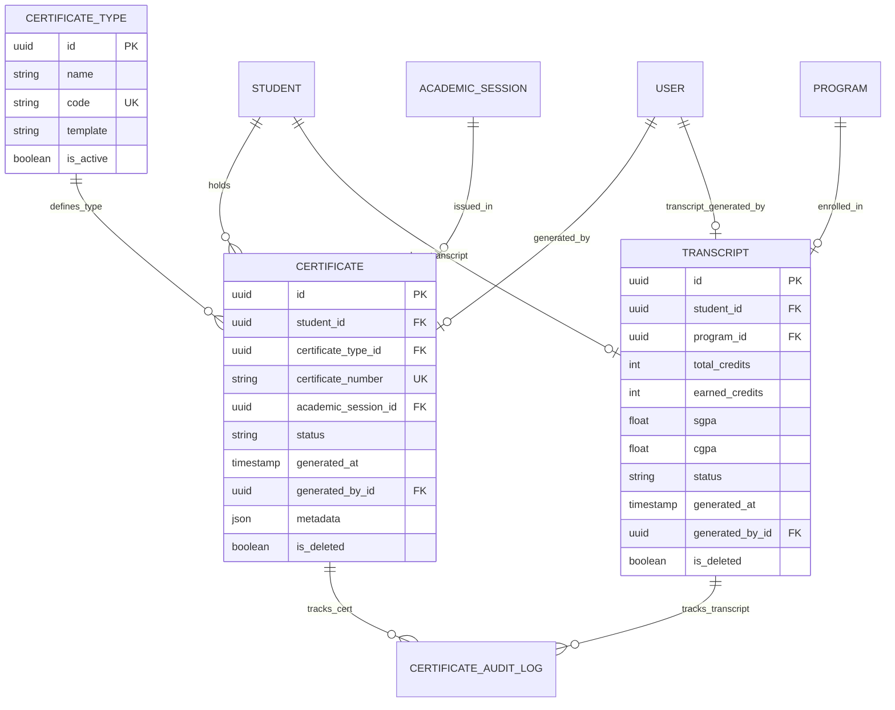

# Enterprise Certificate & Transcript Management System Documentation

## Architecture & Overview

The **Enterprise Certificate & Transcript Management System** (`apps/certificates/`) provides automated generation of academic and administrative certificates (Bonafide, Leaving, Character, Marksheet, Degree, Migration, Provisional), consolidated student transcripts, tamper-proof certificate verification, PDF download payload generation, and audit logging.

### Key Capabilities
- **Certificate Types**: Support for Marksheet, Consolidated Transcript, Bonafide Certificate, Leaving Certificate, Character Certificate, Degree Certificate, Migration Certificate, and Provisional Certificate.
- **Published Results Validation Rule**: Marksheets, Degree Certificates, and Transcripts strictly enforce that the student possesses published semester results prior to generation.
- **Immutability Guarantee**: Issued certificates are immutable once created.
- **Tamper-Proof Verification Portal**: Public verification API endpoint (`/api/certificates/verify/{number}/`) allowing third parties to verify document authenticity.
- **Transcript Engine**: Consolidates total credits, earned credits, latest SGPA, and cumulative CGPA.
- **Audit Logging**: Comprehensive logging for `certificate_generated`, `transcript_generated`, `downloaded`, and `verified` events.

---

## Entity Relationship (ER) Diagram

---

## Certificate & Transcript Workflows

### 1. Certificate Issuance Flow
1. Operator requests certificate generation for a student and certificate type.
2. System checks business rules (e.g. published results required for Marksheet and Degree certificates).
3. Unique `certificate_number` (`CERT-{YEAR}-{CODE}-{HASH}`) is generated.
4. Certificate record is saved with `status = "issued"`.

### 2. Transcript Generation Flow
1. System queries all published `SemesterResult` and `StudentResult` records for the student.
2. Computes total credits, earned credits, latest SGPA, and overall CGPA.
3. Creates or updates the student's `Transcript` record.

### 3. Public Verification Flow
1. Public user or external employer enters `certificate_number`.
2. Verification endpoint checks database validity and returns student name, program, type, status, and issue timestamp.

---

## REST API Reference

| Endpoint | Method | Description |
| :--- | :--- | :--- |
| `/api/certificates/types/` | GET, POST | Certificate Types configuration |
| `/api/certificates/issued/` | GET | Issued Certificates registry |
| `/api/certificates/generate/` | POST | Issue certificate for student |
| `/api/certificates/transcript/generate/` | POST | Generate official transcript |
| `/api/certificates/student/{id}/` | GET | List certificates for a student |
| `/api/certificates/verify/{number}/` | GET | Public certificate verification (AllowAny) |
| `/api/certificates/download/{id}/` | GET | PDF payload download |

---

## Future Integration Hooks

- **Digital Signatures & DigiLocker (TASK-016)**: Will connect certificate verification hashes to cryptographic signatures and DigiLocker push APIs.
