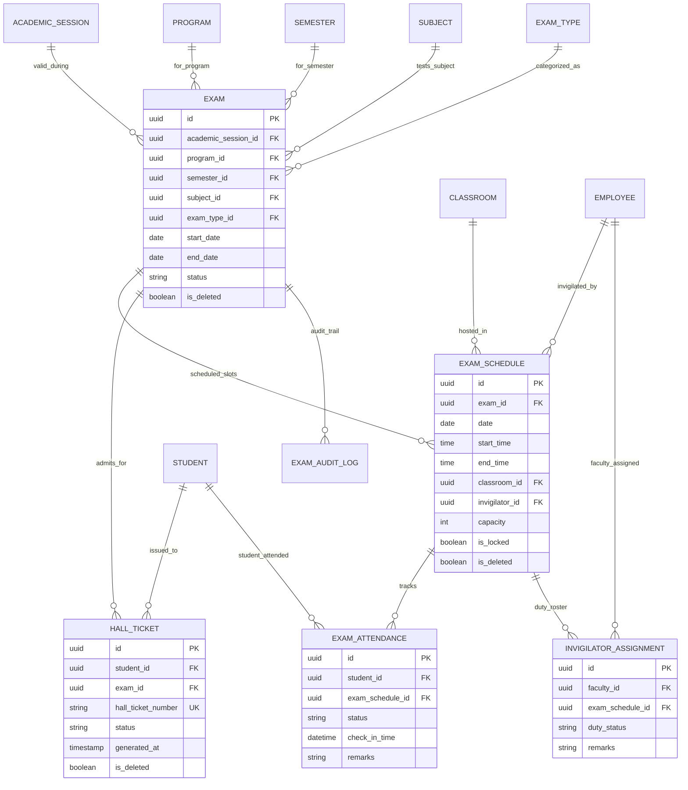

# Enterprise Examination Management System Documentation

## Architecture & Overview

The **Enterprise Examination Management System** (`apps/examinations/`) handles end-to-end exam planning, exam type categorization (Internal, External, Practical, Viva, Mid/End Semester), conflict-free room scheduling, hall ticket issuance, exam room attendance tracking, invigilator duty assignments, and audit logs.

### Key Capabilities
- **Exam Types & Categories**: Support for Internal, External, Practical, Viva, Unit Test, Assignment, Mid Semester, and End Semester.
- **Exam Schedules**: Time window and classroom allocation with Conflict Engine validation.
- **Conflict Prevention Engine**: Prevents classroom double booking and invigilator schedule clashes.
- **Hall Ticket Generation Engine**: Unique hall ticket issuance (`HT-{YEAR}-{SUBJECT}-{HASH}`) required for student exam attendance.
- **Invigilator Duty Assignments**: Track faculty exam supervision duties and status (`assigned`, `confirmed`, `substituted`, `completed`).
- **Audit Logging**: Full audit trail of exam creation, schedule changes, hall ticket issuance, exam attendance, and duty assignments.

---

## Entity Relationship (ER) Diagram

---

## Examination Business Flow

1. **Exam Setup**: Administrator creates an `Exam` mapping Academic Session, Program, Semester, Subject, and `ExamType`.
2. **Scheduling**: `ExamSchedule` entry created with Date, Time Window, and Classroom. Conflict engine verifies zero room or invigilator overlap.
3. **Hall Ticket Issuance**: `ExamService.generate_hall_ticket()` generates unique `HallTicket` for enrolled students.
4. **Exam Attendance**: Exam room invigilator marks attendance. Business rules verify valid Hall Ticket presence and unlocked schedule state before recording.
5. **Invigilator Assignment**: Assigns faculty supervisors with duty status tracking (`assigned`, `confirmed`, `substituted`).

---

## REST API Reference

| Endpoint | Method | Description |
| :--- | :--- | :--- |
| `/api/examinations/types/` | GET, POST | Exam Type list & creation |
| `/api/examinations/exams/` | GET, POST | Exam list & creation |
| `/api/examinations/exams/generate-hall-ticket/` | POST | Generate admit pass for student |
| `/api/examinations/exams/student/{id}/schedule/` | GET | Retrieve student exam timetable |
| `/api/examinations/exams/faculty/{id}/duties/` | GET | Retrieve faculty invigilator duties |
| `/api/examinations/schedules/` | GET, POST | Exam Schedule list & creation |
| `/api/examinations/hall-tickets/` | GET | Issued Hall Tickets roster |
| `/api/examinations/attendances/` | GET | Exam attendance records |
| `/api/examinations/attendances/mark/` | POST | Mark exam attendance (Hall Ticket required) |
| `/api/examinations/invigilators/` | GET, POST | Assign & query invigilator duties |

---

## Future Result Integration Hooks

- **Marks & Grading Engine (TASK-014)**: Will consume `Exam` and `ExamAttendance` records for marks entry, CGPA calculation, and report card generation.
