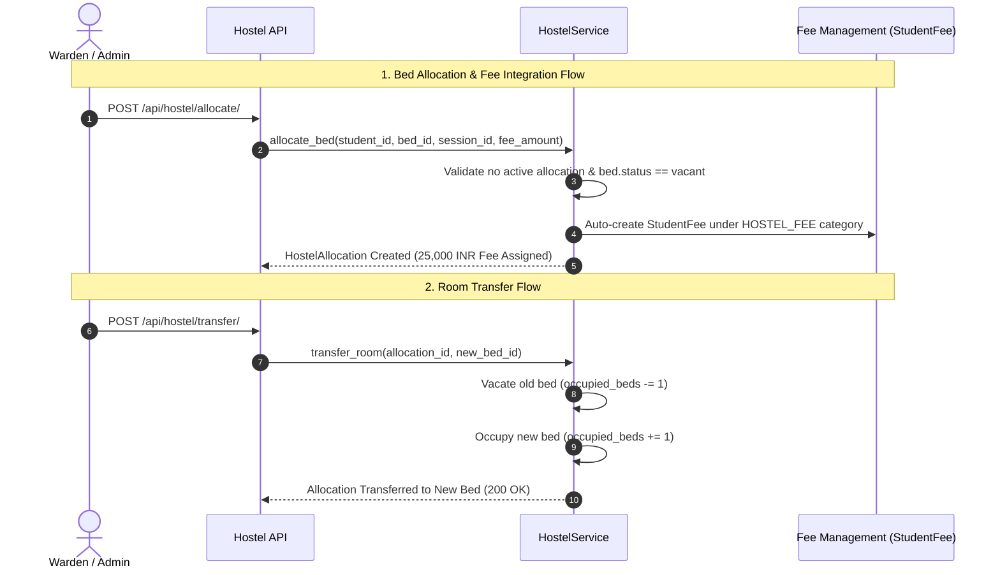

# Enterprise Hostel Management System

## Overview

The `apps/hostel` module provides campus residential infrastructure management for the Enterprise College ERP platform. It supports hostel buildings, wing blocks, floor levels, room & bed inventory, warden assignments, student bed allocations with Fee Management integration, room transfers, check-in/out tracking, visitor registers, and room maintenance tickets.

---

## Architecture

```
apps/hostel/
├── models.py       – Hostel, Block, Floor, Room, Bed, Warden, HostelAllocation, Visitor, MaintenanceRequest, HostelAuditLog
├── services.py     – HostelService (allocate_bed, transfer_room, check_in, check_out, visitor_entry, maintenance_request, vacant_rooms, occupied_rooms)
├── validators.py   – Student active allocation check, Vacant bed check, Room capacity check
├── serializers.py  – DRF Model & Action Request Serializers
├── permissions.py  – IsWardenOrAdmin, IsStudentOrHostelStaff
├── views.py        – ViewSets for Hostels, Blocks, Floors, Rooms, Beds, Allocations, Visitors, Maintenance, Audit Logs
├── urls.py         – API Router & REST convenience endpoints
├── admin.py        – Django Admin configuration
├── signals.py      – Allocation event signals
└── migrations/     – 0001_initial migration
```

---

## ER Diagram & Hierarchy

```
Hostel (Boys / Girls / Coed)
└── Block (Wing A, B, C...)
    └── Floor (1, 2, 3...)
        └── Room (101, 102... Capacity: 1-4)
            └── Bed (101-A, 101-B...)
                └── HostelAllocation (Student <-> Bed)
```

---

## Business Rules & Fee Integration

1. **One Active Allocation per Student**: Students can only have one active hostel allocation (`status` in `allocated`, `checked_in`).
2. **Room Capacity & Vacant Bed Enforcement**: Allocations and room transfers check that `bed.status == 'vacant'` and `room.occupied_beds < room.capacity`.
3. **Fee Management Integration**: When allocating a bed with a `fee_amount`, `HostelService.allocate_bed()` automatically assigns a matching `StudentFee` record under category `HOSTEL_FEE`.
4. **Room Transfer Workflow**: Automatically vacates the current bed (decrementing old room's `occupied_beds`), allocates the target vacant bed (incrementing new room's `occupied_beds`), and updates the allocation record.
5. **Cross-Tenant Isolation**: Enforced via `django-tenants` schema separation.

---

## Room Allocation & Transfer Workflow



---

## REST API Reference

| Method | Endpoint | Description | Permission |
|--------|----------|-------------|------------|
| `GET/POST` | `/api/hostel/hostels/` | Hostel buildings catalog | Warden / Admin |
| `GET/POST` | `/api/hostel/blocks/` | Hostel wing blocks | Warden / Admin |
| `GET/POST` | `/api/hostel/floors/` | Floor levels | Warden / Admin |
| `GET/POST` | `/api/hostel/rooms/` | Room inventory | Authenticated |
| `GET/POST` | `/api/hostel/beds/` | Individual bed units | Authenticated |
| `POST` | `/api/hostel/allocate/` | Allocate vacant bed to student (auto-creates fee) | Warden / Admin |
| `POST` | `/api/hostel/transfer/` | Transfer student to new vacant bed | Warden / Admin |
| `POST` | `/api/hostel/check-in/` | Check in student | Warden / Admin |
| `POST` | `/api/hostel/check-out/` | Check out student & vacate bed | Warden / Admin |
| `GET/POST` | `/api/hostel/visitors/` | Visitor register | Authenticated |
| `GET/POST` | `/api/hostel/maintenance/` | Maintenance ticket management | Authenticated |
| `GET` | `/api/hostel/vacant/` | Vacant rooms breakdown | Authenticated |
| `GET` | `/api/hostel/occupied/` | Occupied rooms breakdown | Authenticated |

---

## Frontend Pages

- `/hostel` — **HostelDashboardPage**: Residential KPIs, bed occupancy rate, active residents, pending maintenance.
- `/hostel/buildings` — **HostelsPage**: Hostel building directory and gender classification.
- `/hostel/blocks-rooms` — **BlocksRoomsPage**: Wing block & room capacity inventory.
- `/hostel/allocations` — **StudentAllocationPage**: Bed assignment form & allocation roster.
- `/hostel/visitors` — **VisitorRegisterPage**: Visitor check-in logging.
- `/hostel/maintenance` — **HostelMaintenancePage**: Room repair and maintenance tickets.
- `/hostel/vacancy` — **VacancyReportPage**: Real-time vacant vs occupied rooms breakdown.

---

## Test Suite Verification

Run module tests:
```bash
pytest tests/test_hostel.py -v
```
Covering Hostel CRUD, bed allocations, room capacity validation, `StudentFee` integration, room transfers, check-in/out, visitor entries, maintenance tickets, and REST permissions.
