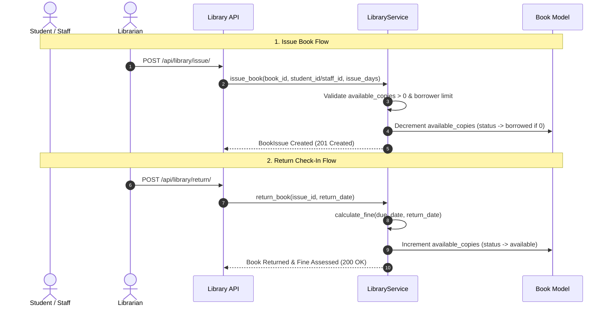

# Enterprise Library Management System

## Overview

The `apps/library` module delivers complete circulation and catalog management for the Enterprise College ERP platform. It supports book cataloging with unique ISBN & barcode indexing, borrower issue limits, check-in return workflows, automated overdue fine calculation, reservation queues, and loss/damage penalty reporting.

---

## Architecture

```
apps/library/
├── models.py       – BookCategory, Author, Publisher, Book, BookIssue, Reservation, LibraryAuditLog
├── services.py     – LibraryService (add_book, issue_book, return_book, reserve_book, calculate_fine, lost_book, damaged_book, book_history)
├── validators.py   – Unique ISBN/Barcode, Book availability, Borrower loan limits
├── serializers.py  – DRF Model & Action Request Serializers
├── permissions.py  – IsLibrarianOrAdmin, IsStudentOrLibrarian
├── views.py        – ViewSets for Catalog, Issues, Returns, Reservations, Fines, Audit Logs
├── urls.py         – API Router & REST convenience endpoints
├── admin.py        – Django Admin configuration
├── signals.py      – Circulation event signals
└── migrations/     – 0001_initial migration
```

---

## Business Rules & Constraints

1. **Unique ISBN & Barcode**: Each book entry requires a globally unique ISBN and physical barcode per tenant.
2. **Book Availability Enforcement**: Books with 0 available copies or non-available status (`borrowed`, `reserved`, `lost`, `damaged`, `maintenance`) cannot be issued.
3. **Borrower Loan Limits**: Max 3 active issued books for students, max 5 for staff members.
4. **Automated Overdue Fines**: Calculated dynamically at rate ₹10.00/day for every day returned past `due_date`.
5. **Reservation Queueing**: Students/staff can reserve unavailable copies. When an issue is granted or returned, pending reservations are automatically updated to `fulfilled`.
6. **Cross-Tenant Isolation**: Enforced via `django-tenants` schema separation.

---

## Issue & Return Workflows



---

## REST API Reference

| Method | Endpoint | Description | Permission |
|--------|----------|-------------|------------|
| `GET/POST` | `/api/library/categories/` | Book category catalog | Librarian / Admin |
| `GET/POST` | `/api/library/authors/` | Author directory | Librarian / Admin |
| `GET/POST` | `/api/library/publishers/` | Publisher directory | Librarian / Admin |
| `GET/POST` | `/api/library/books/` | Book catalog holdings | Authenticated |
| `POST` | `/api/library/issue/` | Issue book copy to borrower | Librarian / Admin |
| `POST` | `/api/library/return/` | Return book copy & calculate fine | Librarian / Admin |
| `POST` | `/api/library/reserve/` | Reserve unavailable book copy | Authenticated |
| `GET` | `/api/library/history/` | Circulation history | Authenticated |
| `GET` | `/api/library/fines/` | Outstanding & paid fines report | Librarian / Admin |
| `POST` | `/api/library/lost/` | Report lost book & assess replacement cost | Librarian / Admin |
| `POST` | `/api/library/damaged/` | Report damaged book & assess penalty | Librarian / Admin |

---

## Frontend Pages

- `/library` — **LibraryDashboardPage**: Catalog overview, total copies, active borrowings, fine collections.
- `/library/books` — **BooksPage**: Full book holdings catalog with ISBN & Barcode search.
- `/library/categories` — **BookCategoriesPage**: Category management & shelf classification.
- `/library/authors-publishers` — **AuthorsPublishersPage**: Author & publisher directory.
- `/library/issue` — **IssueBookPage**: Book check-out & loan period assignment.
- `/library/return` — **ReturnBookPage**: Check-in return processing & fine calculator.
- `/library/reservations` — **ReservationsPage**: Hold requests and queue status.
- `/library/fines` — **FineReportPage**: Comprehensive fine collection & penalty report.

---

## Test Suite Verification

Run module tests:
```bash
pytest tests/test_library.py -v
```
Covering catalog CRUD, duplicate ISBN/barcode rejection, copy decrement, return fine engine, reservation queueing, lost/damaged penalties, and REST permissions.
