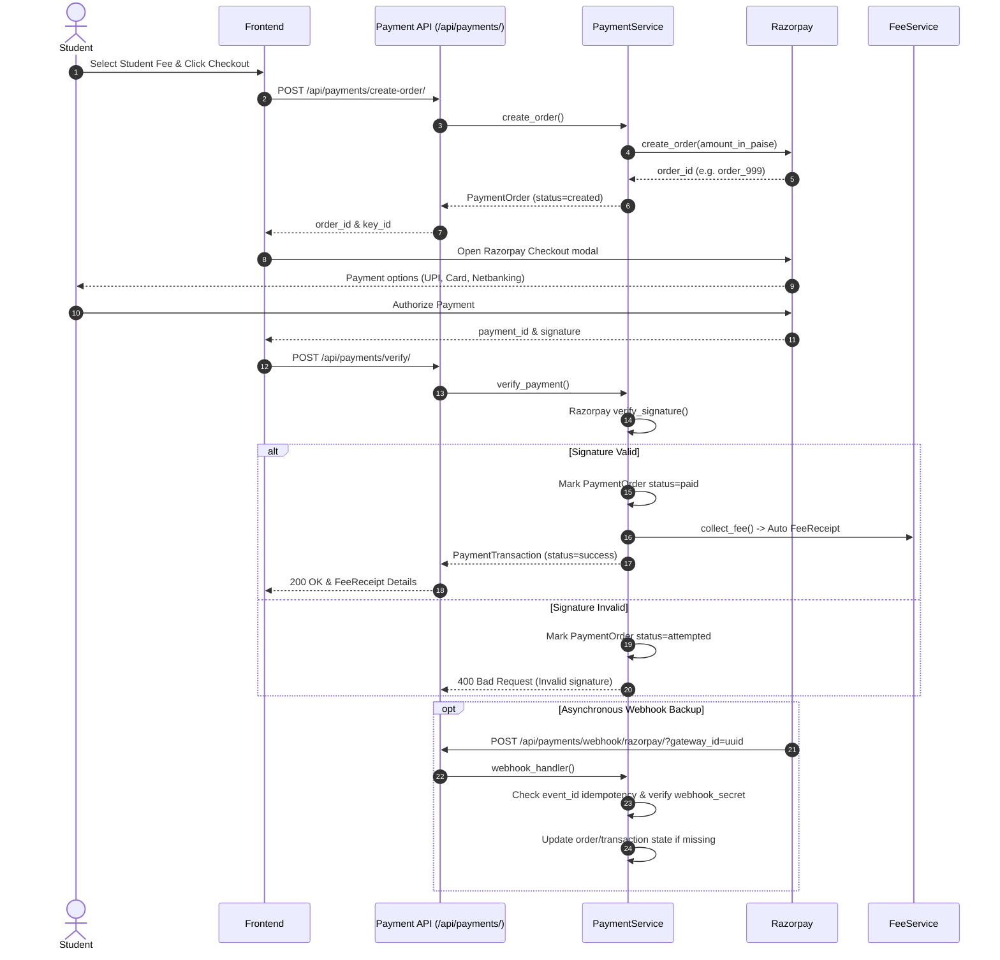

# Enterprise Payment Gateway Integration Module

## Overview

The `apps/payments` module provides online fee payment capabilities for the College ERP platform. It features a provider-agnostic abstraction layer with a production-ready **Razorpay** implementation, auto-generation of official fee receipts upon payment verification, webhook handling with strict deduplication/idempotency, gateway refunds, and audit trail logging.

---

## Architecture & Provider Abstraction

```
apps/payments/
├── models.py       – PaymentGateway, PaymentOrder, PaymentTransaction, WebhookLog, Refund, PaymentAuditLog
├── gateways.py     – BaseGateway interface, RazorpayGateway, GatewayFactory, provider stubs (Stripe, PhonePe, UPI)
├── services.py     – PaymentService (create_order, verify_payment, capture_payment, refund, payment_history, webhook_handler)
├── validators.py   – validate_payment_amount, validate_refund_amount, validate_no_duplicate_order, validate_webhook_not_duplicate
├── serializers.py  – DRF Model & Request Serializers
├── permissions.py  – IsPaymentOfficerOrAdmin, IsStudentOrPaymentOfficer
├── views.py        – ViewSets for Gateways, Orders, Transactions, Refunds, Webhooks
├── urls.py         – API Router & REST endpoints
├── admin.py        – Django Admin with read-only audit inlines
├── signals.py      – Transaction-order state synchronization
└── migrations/     – 0001_initial migration
```

### Supported & Prepared Gateways
- **Razorpay**: Fully implemented (Order creation, signature verification, webhook processing, refund API).
- **Stripe**: Interface prepared (stubbed in `gateways.py` for TASK-018).
- **PhonePe**: Interface prepared (stubbed in `gateways.py` for TASK-018).
- **UPI**: Interface prepared (stubbed in `gateways.py` for TASK-018).

---

## Models Schema

### `PaymentGateway`
Configured gateway instances.
- `id` (UUID)
- `name` (CharField) — e.g. "Razorpay Production"
- `provider` (ChoiceField) — `razorpay`, `stripe`, `phonepe`, `upi`, `manual`
- `is_active` (BooleanField)
- `config` (JSONField) — stores API credentials (`key_id`, `key_secret`, `webhook_secret`)

### `PaymentOrder`
Gateway-side order representation created prior to payment checkout.
- `id` (UUID)
- `student` (FK -> Student)
- `student_fee` (FK -> StudentFee)
- `gateway` (FK -> PaymentGateway)
- `order_id` (CharField, Unique) — Gateway-assigned order identifier
- `amount` (DecimalField)
- `currency` (CharField) — Default `INR`
- `status` (ChoiceField) — `created`, `attempted`, `paid`, `expired`, `cancelled`

### `PaymentTransaction`
Immutable record of an attempted or completed payment.
- `id` (UUID)
- `student` (FK -> Student)
- `order` (OneToOne -> PaymentOrder)
- `fee_receipt` (FK -> FeeReceipt, Nullable) — Auto-linked when fee receipt is generated
- `gateway` (FK -> PaymentGateway)
- `transaction_id` (CharField, Unique) — Gateway payment ID
- `gateway_order_id` (CharField)
- `gateway_payment_id` (CharField)
- `gateway_signature` (CharField)
- `amount` (DecimalField)
- `currency` (CharField)
- `status` (ChoiceField) — `initiated`, `success`, `failed`, `refunded`, `partial_refund`
- `paid_at` (DateTimeField)

### `Refund`
Gateway refund records initiated by staff/admin.
- `id` (UUID)
- `transaction` (FK -> PaymentTransaction)
- `refund_id` (CharField) — Gateway-assigned refund identifier
- `amount` (DecimalField)
- `reason` (CharField)
- `status` (ChoiceField) — `requested`, `processing`, `success`, `failed`
- `initiated_by` (FK -> User)

### `WebhookLog`
Raw webhook audit log supporting idempotency deduplication.
- `id` (UUID)
- `gateway` (FK -> PaymentGateway)
- `event_id` (CharField)
- `event_type` (CharField) — e.g. `payment.captured`
- `payload` (JSONField)
- `is_processed` (BooleanField)

### `PaymentAuditLog`
Append-only log of payment events (`order_created`, `payment_initiated`, `payment_success`, `payment_failed`, `webhook_received`, `refund_requested`, `refund_success`, `signature_verified`, `signature_failed`).

---

## Payment & Webhook Workflow



---

## REST API Reference

| Method | Endpoint | Description | Permission |
|--------|----------|-------------|------------|
| `GET` | `/api/payments/gateways/` | List configured payment gateways | Staff / Admin |
| `POST` | `/api/payments/create-order/` | Create gateway order for checkout | Authenticated |
| `POST` | `/api/payments/verify/` | Verify Razorpay signature & generate receipt | Authenticated |
| `GET` | `/api/payments/history/?student_id={id}` | Student payment history | Student / Staff |
| `POST` | `/api/payments/refund/` | Initiate refund for a transaction | Staff / Admin |
| `POST` | `/api/payments/webhook/razorpay/?gateway_id={id}` | Inbound Razorpay webhook listener | Public / Gateway |
| `GET` | `/api/payments/transactions/` | List all transactions | Authenticated |
| `GET` | `/api/payments/transactions/{id}/` | Inspect single transaction details | Authenticated |
| `GET` | `/api/payments/refunds/` | List all refund records | Staff / Admin |
| `GET` | `/api/payments/webhook-logs/` | Inspect raw webhook audit logs | Staff / Admin |

---

## Business Rules & Security Enforcements

1. **Amount Bounds**: Minimum ₹1.00, Maximum ₹5,00,000.00 per transaction.
2. **Duplicate Active Order Guard**: Active (`created`/`attempted`) orders for the same `StudentFee` are blocked until resolved.
3. **Refund Limits**: Refund amount cannot exceed original transaction amount. Only `success` or `partial_refund` transactions are refundable.
4. **Idempotency**: Duplicate webhook `event_id` payloads are detected and ignored.
5. **Cross-Tenant Isolation**: Payment orders, transactions, and audit logs are tied to tenant schemas via `django-tenants`.

---

## Frontend Integration

Available React Pages under `/payments`:
- `/payments` — **PaymentDashboardPage**: Stats, configured gateways, transaction history.
- `/payments/pay` — **PayFeesPage**: Student lookup, gateway selector, Razorpay order creation & signature verification simulator.
- `/payments/history` — **PaymentHistoryPage**: Student payment logs and receipt references.
- `/payments/details` — **TransactionDetailsPage**: Deep inspection & gateway refund trigger form.
- `/payments/refunds` — **RefundHistoryPage**: Log of all requested and settled refunds.

---

## Test Verification

Run test suite:
```bash
pytest tests/test_payments.py -v
```

13 test cases covering:
- Gateway Factory instantiation & provider validation
- Razorpay signature HMAC-SHA256 verification
- Order creation & service limits
- Signature verification success & auto-receipt generation
- Invalid signature rejection & status tracking
- Refund processing & over-refund prevention
- Webhook processing & event_id idempotency
- API endpoint permission boundaries (401, 403, 201)
