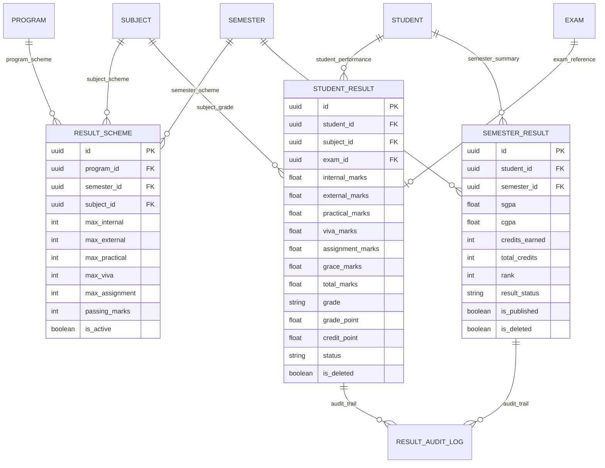

# Enterprise Result Management System Documentation

## Architecture & Overview

The **Enterprise Result Management System** (`apps/results/`) handles grade scheme configuration, multi-component marks entry (Internal, External, Practical, Viva, Assignment, Grace), automatic grade and credit point calculation, SGPA and CGPA computation, batch merit rank generation, result publishing, transcript preview, and audit trail logging.

### Key Capabilities
- **Result Scheme**: Subject-specific maximum limits for internal, external, practical, viva, assignment marks, and passing thresholds.
- **Grade & Credit Engine**: Automatic percentage calculation, grade assignment (A+ to F), grade point determination, and credit point computation (`Grade Point × Subject Credits`).
- **SGPA Engine**: Semester Grade Point Average calculated as:
  $$\text{SGPA} = \frac{\sum (\text{Grade Point}_i \times \text{Credits}_i)}{\sum \text{Credits}_i}$$
- **CGPA Engine**: Cumulative Grade Point Average calculated as:
  $$\text{CGPA} = \frac{\sum (\text{SGPA}_j \times \text{Total Credits}_j)}{\sum \text{Total Credits}_j}$$
- **Rank Generation Engine**: Automated batch ranking of students within a semester based on SGPA and credits earned.
- **Publishing Pipeline**: Validated semester results publishing with status update propagation to student subject records.
- **Audit Logging**: Comprehensive logging for `marks_entered`, `marks_updated`, `marks_verified`, `results_published`, and `result_corrected`.

---

## Entity Relationship (ER) Diagram

---

## Grade Rules System

| Percentage Range | Grade | Grade Point | Performance Description |
| :--- | :---: | :---: | :--- |
| **>= 90%** | `A+` | **10.0** | Outstanding |
| **>= 80%** | `A` | **9.0** | Excellent |
| **>= 70%** | `B+` | **8.0** | Very Good |
| **>= 60%** | `B` | **7.0** | Good |
| **>= 50%** | `C` | **6.0** | Above Average |
| **>= 40%** | `D` | **5.0** | Pass / Marginal |
| **< 40%** | `F` | **0.0** | Fail |

---

## REST API Reference

| Endpoint | Method | Description |
| :--- | :--- | :--- |
| `/api/results/schemes/` | GET, POST | Result Scheme configuration |
| `/api/results/student-results/` | GET, POST | List & Enter marks for a student |
| `/api/results/calculate/` | POST | Calculate SGPA & CGPA for a student & semester |
| `/api/results/publish/` | POST | Publish results for an entire semester |
| `/api/results/student/{id}/` | GET | Retrieve complete student subject history |
| `/api/results/semester/{id}/` | GET | Retrieve semester result summary roster |
| `/api/results/transcript-preview/` | GET | Academic transcript preview data |
| `/api/results/semester-results/rank/` | POST | Batch generate merit ranks for a semester |

---

## Future Integration Hooks

- **Degree Certificate & Transcript PDF (TASK-015)**: Will consume published `SemesterResult` and `StudentResult` data to render printable degree certificates and official transcript PDFs.
