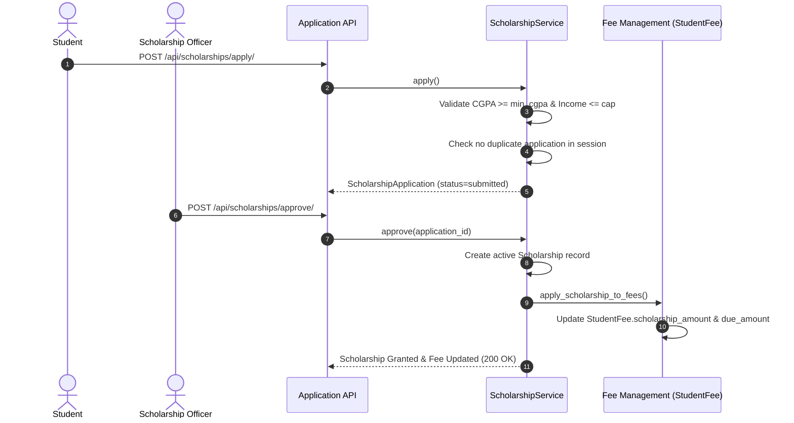

# Enterprise Scholarship Management System

## Overview

The `apps/scholarships` module handles the complete lifecycle of financial aid, merit programs, government/private awards, fee waivers, and multi-year renewals. It directly integrates with the **Fee Management** module (`apps/fees`) to automatically deduct granted scholarship amounts or apply fee waivers to student balances (`StudentFee.scholarship_amount` & `StudentFee.due_amount`).

---

## Architecture & Integration

```
apps/scholarships/
├── models.py       – ScholarshipType, Scholarship, ScholarshipApplication, ScholarshipRenewal, ScholarshipAuditLog
├── services.py     – ScholarshipService (apply, approve, reject, renew, apply_scholarship_to_fees, apply_fee_waiver, calculate_discount)
├── validators.py   – validate_eligibility (CGPA & income caps), validate_no_duplicate_application, validate_no_duplicate_scholarship
├── serializers.py  – DRF Model & Action Serializers
├── permissions.py  – IsScholarshipOfficerOrAdmin, IsStudentOrScholarshipOfficer
├── views.py        – ViewSets for Types, Scholarships, Applications, Renewals, Audit Logs
├── urls.py         – API Router & REST convenience endpoints
├── admin.py        – Django Admin with bulk approval action
├── signals.py      – Scholarship status synchronization signals
└── migrations/     – 0001_initial migration
```

---

## Data Models

### `ScholarshipType`
Catalog of available financial aid programs.
- `id` (UUID)
- `name` (CharField) — e.g. "Merit Excellence Scholarship"
- `code` (CharField, Unique) — e.g. "MERIT-100"
- `provider` (ChoiceField) — `government`, `private`, `merit`, `sports`, `minority`, `need_based`, `fee_waiver`
- `min_cgpa_requirement` (FloatField) — Minimum CGPA required (0.0 to 10.0)
- `max_family_income` (DecimalField, Optional) — Annual family income ceiling
- `is_active` (BooleanField)

### `Scholarship`
Granted active/historical scholarship assigned to a student.
- `id` (UUID)
- `student` (FK -> Student)
- `scholarship_type` (FK -> ScholarshipType)
- `academic_session` (FK -> AcademicSession)
- `amount` (DecimalField) — Flat amount in INR
- `percentage` (FloatField) — Percentage discount (0-100%)
- `start_date` / `end_date` (DateField)
- `status` (ChoiceField) — `active`, `suspended`, `expired`, `revoked`

**Unique Constraint**: `("student", "scholarship_type", "academic_session")`

### `ScholarshipApplication`
Student application & approval workflow record.
- `id` (UUID)
- `student` (FK -> Student)
- `scholarship_type` (FK -> ScholarshipType)
- `academic_session` (FK -> AcademicSession)
- `requested_amount` (DecimalField)
- `family_annual_income` (DecimalField, Optional)
- `current_cgpa` (FloatField)
- `documents` (JSONField) — Verification document metadata
- `status` (ChoiceField) — `draft`, `submitted`, `under_review`, `approved`, `rejected`
- `approved_by` (FK -> User)
- `approved_at` (DateTimeField)

### `ScholarshipRenewal`
Annual renewal tracking for multi-year programs.
- `id` (UUID)
- `scholarship` (FK -> Scholarship)
- `academic_session` (FK -> AcademicSession)
- `status` (ChoiceField) — `requested`, `approved`, `rejected`
- `processed_by` (FK -> User)

### `ScholarshipAuditLog`
Append-only log recording event history (`application_submitted`, `application_approved`, `application_rejected`, `scholarship_applied`, `scholarship_renewed`, `scholarship_revoked`).

---

## Workflow & Fee Integration



---

## REST API Reference

| Method | Endpoint | Description | Permission |
|--------|----------|-------------|------------|
| `GET/POST` | `/api/scholarships/types/` | Catalog of scholarship programs | Staff / Admin |
| `POST` | `/api/scholarships/apply/` | Submit scholarship application | Authenticated |
| `POST` | `/api/scholarships/approve/` | Approve application & trigger fee deduction | Staff / Admin |
| `POST` | `/api/scholarships/reject/` | Reject application with reason | Staff / Admin |
| `POST` | `/api/scholarships/renew/` | Renew scholarship for new session | Staff / Admin |
| `GET` | `/api/scholarships/student/{id}/` | Get student granted scholarships | Student / Staff |
| `GET` | `/api/scholarships/applications/` | List all applications | Authenticated |
| `GET` | `/api/scholarships/renewals/` | List all renewal records | Staff / Admin |
| `GET` | `/api/scholarships/audit-logs/` | Inspect audit trail | Staff / Admin |

---

## Business Rules & Security Enforcements

1. **One Scholarship per Type per Session**: A student cannot have multiple active scholarships or applications of the same type within the same academic session.
2. **Eligibility Validation**: CGPA must meet or exceed `min_cgpa_requirement`; family income must not exceed `max_family_income` (if defined).
3. **Automated Fee Update**: Upon approval or renewal, `apply_scholarship_to_fees()` automatically deducts the granted amount or percentage from matching `StudentFee` records and recalculates `due_amount` and `status` (`waived` or `paid`).
4. **Cross-Tenant Isolation**: Enforced via `django-tenants` schema separation.

---

## Frontend Integration

Available React Pages under `/scholarships`:
- `/scholarships` — **ScholarshipDashboardPage**: Program stats, total aid disbursed, recent beneficiaries.
- `/scholarships/types` — **ScholarshipTypesPage**: Catalog manager for CGPA minimums & income caps.
- `/scholarships/student` — **StudentScholarshipsPage**: Student lookup for active & past scholarships.
- `/scholarships/applications` — **ScholarshipApplicationsPage**: Application review roster with approval/rejection actions.
- `/scholarships/renewals` — **ScholarshipRenewalsPage**: Multi-year renewal tracking log.
- `/scholarships/eligibility` — **EligibilityCheckerPage**: Instant rule evaluator for student CGPA & income.

---

## Test Suite Verification

Run test suite:
```bash
pytest tests/test_scholarships.py -v
```

Covering:
- ScholarshipType CRUD
- Eligibility validation (min CGPA & income caps)
- Application approval & automated `StudentFee` deduction
- Rejection workflow & reasons
- Scholarship renewals across academic sessions
- REST API permissions (401, 403, 200, 201)
