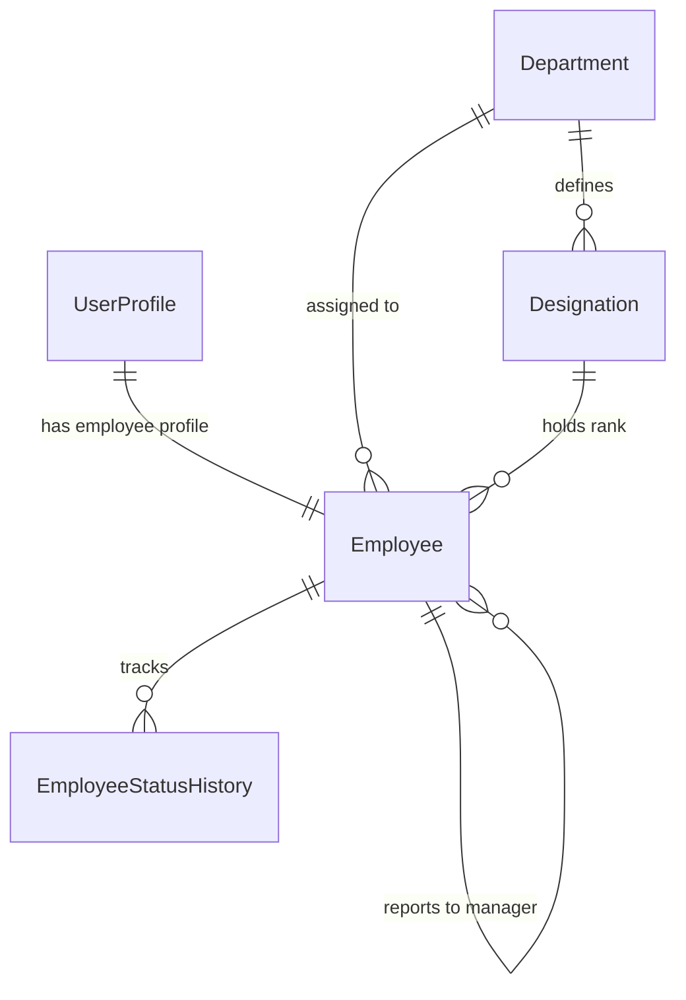
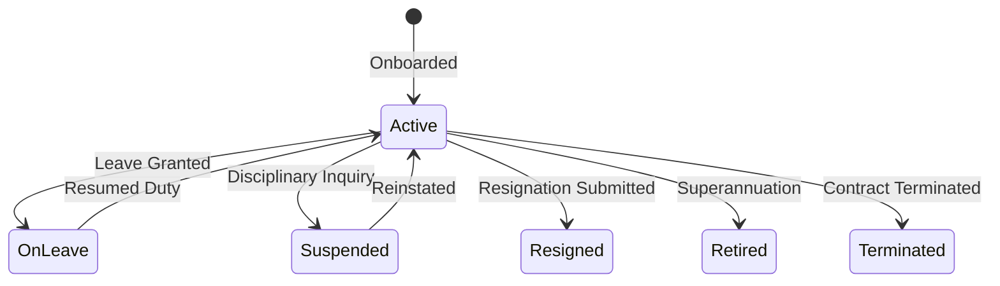

# Enterprise Staff & Employee Management System Documentation

## 1. System Architecture & Model Design

The **Staff & Employee Management System** (`apps/staff`) manages all academic faculty and non-teaching personnel within the College ERP, binding identity profiles with organizational placement and designation ranks.

---

## 2. Employee Code Generation Formula

Employee IDs are automatically generated upon onboarding using the pattern:

$$\text{Employee ID} = \text{"EMP-"} + \text{YEAR} + \text{"-"} + \text{SEQUENCE\_NUMBER (5 digits)}$$

**Examples**:
- `EMP-2026-00001`
- `EMP-2026-00002`

---

## 3. Employment Lifecycle & Status Transitions

Every status change writes an immutable `EmployeeStatusHistory` record tracking `previous_status`, `new_status`, `changed_by`, `reason`, and `timestamp`.

---

## 4. REST API Reference

| Endpoint Path | Method | Description |
| :--- | :--- | :--- |
| `/api/staff/designations/` | `GET / POST` | List & create designations |
| `/api/staff/employees/` | `GET / POST` | List & onboard employees |
| `/api/staff/employees/<id>/` | `GET / PATCH / DELETE` | Detail, update, or soft-delete employee |
| `/api/staff/employees/<id>/suspend/` | `POST` | Suspend employee |
| `/api/staff/employees/<id>/reinstate/` | `POST` | Reinstate employee to active duty |
| `/api/staff/employees/<id>/resign/` | `POST` | Process resignation |
| `/api/staff/employees/<id>/retire/` | `POST` | Process retirement |
| `/api/staff/employees/<id>/terminate/` | `POST` | Terminate employment contract |
| `/api/staff/employees/<id>/status-history/` | `GET` | Retrieve complete audit log history |
| `/api/staff/dashboard-summary/` | `GET` | Total staff, active count, teaching vs non-teaching |

---

## 5. Future Integration Roadmap

1. **TASK-009+: Attendance & Biometric Integration**: Employee clock-in/out & attendance logs.
2. **Leave Management Engine**: Annual leave quotas, sick leave requests, leave approval workflows.
3. **Payroll & Compensation Engine**: Salary structures, allowances, tax deductions, pay slips.
4. **Timetable & Faculty Workload**: Course subject load allocation & lecture scheduling.
