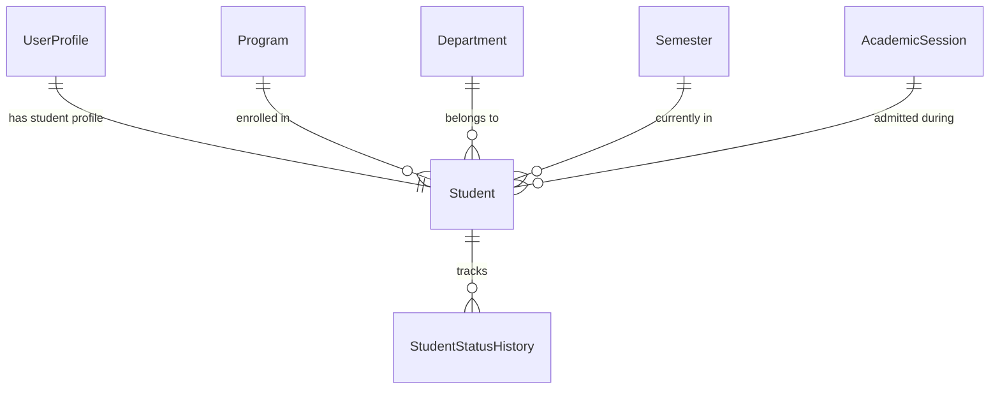
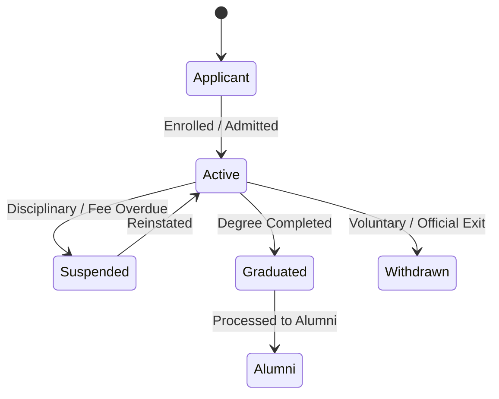

# Enterprise Student Management System Documentation

## 1. System Architecture & Model Design

The **Student Management System** (`apps/students`) extends the core User Profile with institutional academic attributes, auto-generated student identification codes, and status transition auditing.

---

## 2. Student Identification & Code Generation Formula

Student IDs are automatically generated upon onboarding using the pattern:

$$\text{Student ID} = \text{"ERP-"} + \text{YEAR} + \text{"-"} + \text{SANITISED\_PROGRAM\_CODE} + \text{"-"} + \text{SEQUENCE\_NUMBER (5 digits)}$$

**Examples**:
- `ERP-2026-BSCIT-00001`
- `ERP-2026-BSCIT-00002`
- `ERP-2026-MBA-00001`

---

## 3. Student Lifecycle & Status Transition Rules

Every status change records an immutable `StudentStatusHistory` entry containing:
- `previous_status`
- `new_status`
- `changed_by` (User FK)
- `reason`
- `timestamp`

---

## 4. REST API Reference

| Endpoint Path | Method | Description |
| :--- | :--- | :--- |
| `/api/students/` | `GET / POST` | List & onboard students |
| `/api/students/<id>/` | `GET / PATCH / DELETE` | Detail, update, or soft-delete student |
| `/api/students/<id>/suspend/` | `POST` | Suspend student with reason |
| `/api/students/<id>/reinstate/` | `POST` | Reinstate suspended student to active |
| `/api/students/<id>/graduate/` | `POST` | Mark student as graduated |
| `/api/students/<id>/withdraw/` | `POST` | Withdraw student record |
| `/api/students/<id>/status-history/` | `GET` | Retrieve complete status history audit log |
| `/api/students/dashboard-summary/` | `GET` | Active, suspended, graduated counts & breakdown |
| `/api/students/bulk-import/` | `POST` | Bulk CSV import placeholder |
| `/api/students/bulk-export/` | `GET` | Bulk CSV export placeholder |
| `/api/students/bulk-status-update/` | `POST` | Batch status update |

---

## 5. Future Integration Roadmap

1. **TASK-008: Staff Management**: Staff/Faculty assignment as Academic Advisors & Class Coordinators.
2. **TASK-009+: Attendance Engine**: Daily & course subject attendance tracking linked to `Student.id`.
3. **Examination & Grading System**: Transcripts, GPA, CGPA calculation per semester.
4. **Finance & Fee Management**: Fee head assignment, fee collection, overdue auto-suspensions.
5. **Parent Portal**: Authentication & view access for guardians linked via `guardian_phone` / `father_phone`.
