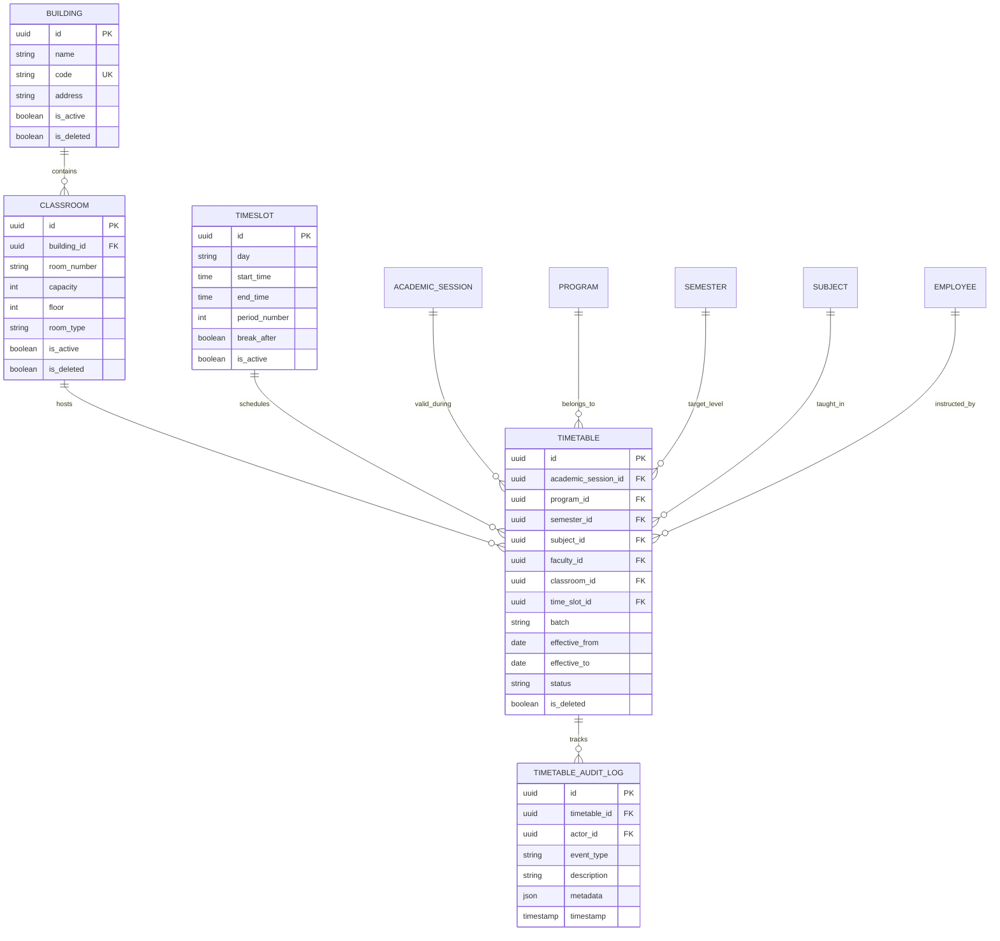

# Enterprise Timetable Management System Documentation

## Architecture & Overview

The **Enterprise Timetable Management System** (`apps/timetable/`) provides comprehensive scheduling, period allocation, and conflict detection for multi-tenant institutional operations.

### Key Capabilities
- **Infrastructure Registry**: Buildings, Classrooms, Laboratories, Seminar Halls, and Auditoriums.
- **Period Time Slots**: Configurable day/period slots with break support.
- **Master Timetable Entries**: Mapping Academic Session, Program, Semester, Subject, Faculty Employee, Classroom, and TimeSlot.
- **Real-Time Conflict Detection Engine**: Prevents Faculty Double Booking, Classroom Double Booking, and Batch Double Booking.
- **Multi-View Schedule Queries**: Specialized views for Faculty Workload, Student Schedules, Room Occupancy, and Weekly Master Grid.
- **Comprehensive Audit Logs**: Audit log tracking for entry creation, updates, room changes, faculty re-assignments, and soft deletions.

---

## Entity Relationship (ER) Diagram

---

## Conflict Detection Engine Rules

Validation checks implemented in `validators.py` and `services.py`:

1. **Faculty Double Booking**:
   - Ensures no instructor is assigned to more than one classroom/lecture during the same `TimeSlot`.
2. **Classroom Double Booking**:
   - Ensures no classroom or lab is assigned to more than one faculty/subject during the same `TimeSlot`.
3. **Batch Double Booking**:
   - Ensures students of a given program, semester, and batch (`all` or specific batch) are not scheduled for multiple lectures simultaneously.

---

## REST API Reference

| Endpoint | Method | Description |
| :--- | :--- | :--- |
| `/api/timetable/buildings/` | GET, POST | Building infrastructure list & creation |
| `/api/timetable/classrooms/` | GET, POST | Classroom & lab room list & creation |
| `/api/timetable/timeslots/` | GET, POST | TimeSlot period list & creation |
| `/api/timetable/entries/` | GET, POST | Timetable entries list & creation |
| `/api/timetable/entries/check-conflicts/` | POST | Test proposed slot for scheduling clashes |
| `/api/timetable/entries/faculty/{id}/` | GET | Retrieve faculty instructor schedule |
| `/api/timetable/entries/student/` | GET | Retrieve student schedule (by program/semester/batch) |
| `/api/timetable/entries/room/{id}/` | GET | Retrieve classroom occupancy schedule |
| `/api/timetable/entries/weekly/` | GET | Master institutional weekly schedule matrix |

---

## Future Integration Hooks

- **Attendance Engine (TASK-012)**: Daily & course-wise attendance tracking using scheduled timetable entries.
- **Examinations Engine**: Exam hall seat allocation & time slot scheduling.
- **AI Timetable Generator**: Auto-generation of conflict-free weekly master schedules.
